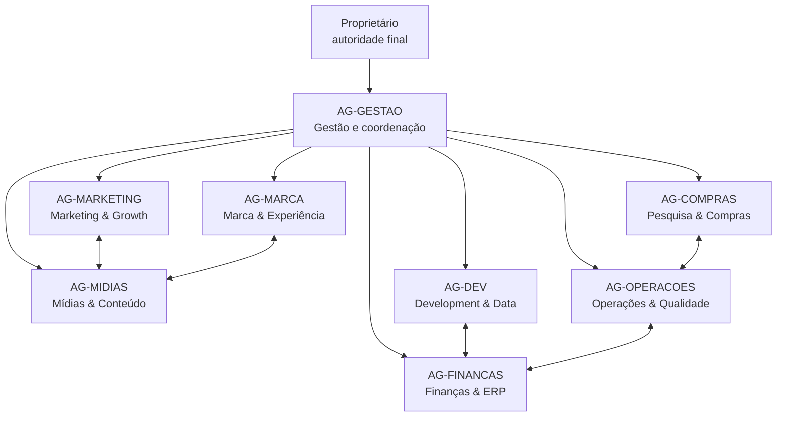

# Organização dos agentes

## Estrutura

## Contrato comum

Cada agente recebe: objetivo, contexto, tarefa, restrições, dependências e critério de aceite. Cada entrega devolve: resultado, evidência, impactos no plano, riscos, decisão necessária e próximo passo.

Agentes não autoaprovam gastos, publicações, mudanças legais/fiscais ou alterações críticas de produção. A Gestão revisa; o proprietário decide quando houver custo, exposição pública ou mudança de escopo.

## Frentes primordiais

### Gestão

Entradas: plano, orçamento, riscos e entregas.  
Saídas: prioridade semanal, decisões, aprovação de requisições e relatório executivo.  
KPIs: caminho crítico em dia, decisões vencidas, orçamento comprometido e bloqueios sem dono.  
Cadência: revisão diária durante implantação e abertura.

### Marketing & Growth

Entradas: capacidade operacional, margem, público, campanhas e vendas conciliadas.  
Saídas: plano de aquisição, oferta, orçamento de mídia, UTMs, experimentos e leitura de funil.  
KPIs: CAC, conversão em pedido pago, ROAS por margem, frequência, recompra e receita incremental.  
Handoff: brief para Mídias; requisitos de tracking para Development; limite de promoção para Finanças.

### Mídias & Conteúdo

Entradas: calendário, brief, produto aprovado e biblioteca de marca.  
Saídas: fotos, vídeos, copies, cortes, legendas, capas, versões e metadados de direitos.  
KPIs: ativos aprovados no prazo, retenção, salvamentos, cliques qualificados e cobertura do calendário.  
Handoff: peças para Marketing; derivados de marca para Marca; arquivos finais para biblioteca.

### Development & Data

Entradas: design aprovado, contrato do ERP, eventos, domínios e critérios de negócio.  
Saídas: site, integração, tracking, painel, testes, documentação, alertas e exportações.  
KPIs: disponibilidade, Core Web Vitals, erros de integração, conciliação, conversão medida e incidentes.  
Handoff: dados de pedido para Finanças; funil para Marketing; falhas operacionais para Gestão.

## Frentes de sustentação

### Pesquisa & Compras

Entrada padrão: `item + requisito mínimo + quantidade + CEP/local + data necessária + teto`.  
Saída padrão: comparação de três opções, custo total, avaliações, prazo, garantia, riscos e recomendação.  
KPIs: economia versus referência, prazo atendido, devoluções, ruptura evitada e fornecedores alternativos.

### Operações & Qualidade

Entradas: cardápio, espaço, equipamentos, volume e exigências sanitárias.  
Saídas: SOPs, layout, escalas, treinamento, capacidade, checklists e registros de qualidade.  
KPIs: tempo de preparo, erro, desperdício, ruptura, temperatura conforme plano e incidentes.

### Finanças & ERP

Entradas: fichas, cotações, vendas, despesas, tributos e contratos.  
Saídas: preço, orçamento, DRE, caixa, plano de contas, conciliação e configuração do ERP.  
KPIs: margem, CMV, caixa projetado, divergência de conciliação e dados sem classificação.

### Marca & Experiência

Entradas: ativos originais, ambiente, embalagem, peças e feedback.  
Saídas: sistema visual, padrões, sinalização, etiquetas, jornada e aprovação de consistência.  
KPIs: peças conformes, legibilidade, consistência, avaliação visual e retrabalho.

## RACI resumido

Legenda: R responsável, A aprovador, C consultado, I informado.

| Entrega | Gestão | Marketing | Mídias | Dev | Compras | Operações | Finanças | Marca |
|---|---|---|---|---|---|---|---|---|
| Cardápio e preço | A | C | I | C | C | R | R | C |
| Seleção do ERP | A | C | I | R | C | C | R | I |
| Site `/welcome` | A | C | C | R | I | I | I | R |
| Integração `/cardapio` | A | I | I | R | I | C | R | I |
| Campanha paga | A | R | R | C | I | C | C | C |
| Equipamentos e insumos | A | I | I | I | R | R | C | C |
| Rotina do quiosque | A | I | C | C | C | R | C | C |
| Relatório semanal | R | C | C | C | C | C | C | C |

## Prompts de despacho

### Pesquisa de compra

> Pesquise o item `[...]` para uso `[...]`, quantidade `[...]`, entrega em `[...]` até `[...]`. Requisitos eliminatórios: `[...]`. Compare no mínimo três opções aprovadas por custo total, nota e quantidade de avaliações, garantia, assistência, frete e prazo. Use fontes atuais, registre a data e não efetue a compra. Envie a recomendação como requisição `create_procurement_item` ou `update_procurement_item`.

### Nova tarefa

> Leia o plano atual. Proponha uma tarefa pequena e verificável para alcançar `[...]`. Informe agente responsável, pilar, fase, impacto, urgência, dependências e critérios de aceite. Envie por `POST /api/requests` com ação `create_task`.

### Atualização executiva

> Leia tarefas, decisões, riscos e requisições. Resuma apenas mudanças desde o último ciclo: resultados, evidências, bloqueios, decisões vencidas, orçamento afetado e próximos passos. Não transforme hipótese em fato.

