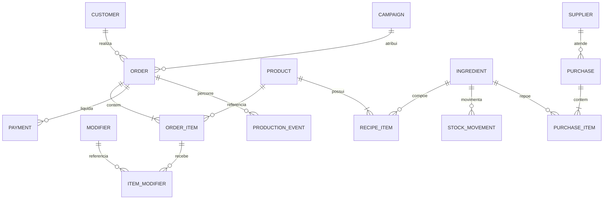

# Dados, ERP e integrações

## Princípio

O objetivo não é “ter muitos dados”; é garantir que cada pedido pago produza registros conciliáveis para estoque, produção, financeiro, marketing e melhoria da experiência.

## Teste eliminatório do ERP

O fornecedor precisa demonstrar, com um pedido real de Chefão:

1. dois espetos selecionáveis, inclusive regra de repetição;
2. até dois adicionais gratuitos e adicionais pagos separados;
3. remoção de ingredientes impressa/exibida para produção;
4. baixa de receita e estoque por ingrediente/modificador;
5. pedido originado em totem, atendimento e web com canal identificado;
6. pagamento, cancelamento, estorno e conciliação;
7. fila de produção, status e tempo por etapa;
8. exportação/API/webhook com IDs estáveis;
9. fiscal, financeiro e permissões por função;
10. operação contingencial quando internet ou equipamento falhar.

Sem demonstração, a resposta comercial do fornecedor não conta como requisito atendido.

## Entidades mínimas

Cliente deve ser opcional no balcão. Para análise de recorrência, use identificador pseudonimizado quando possível e separe consentimento de marketing do processamento do pedido.

## Campos críticos do pedido

- `order_id`, `external_order_id` e `idempotency_key`;
- canal: `counter`, `totem`, `web`, futuro `delivery`;
- horário de criação, aprovação, início, pronto, entrega e cancelamento;
- item, modificadores, remoções, quantidade, preço de tabela, desconto e preço líquido;
- custo teórico vigente no momento da venda;
- método/status de pagamento, sem dados do cartão;
- campanha/UTM quando disponível;
- motivo estruturado de cancelamento, erro e cortesia;
- versão do catálogo/receita.

## Eventos e funil

| Evento | Origem | Chave de ligação | Uso |
|---|---|---|---|
| `welcome_view` | site | sessão anônima | alcance qualificado |
| `menu_open` | site/ERP | sessão anônima | passagem para intenção |
| `product_view` | ERP | produto + sessão | interesse por item |
| `add_to_cart` | ERP | produto + carrinho | atrito de escolha |
| `checkout_start` | ERP | carrinho | abandono |
| `payment_approved` | ERP/adquirente | pedido | conversão real |
| `order_in_production` | ERP/KDS | pedido | início do SLA |
| `order_ready` | ERP/KDS | pedido | tempo de preparo |
| `order_delivered` | ERP | pedido | conclusão |
| `repeat_order` | análise | cliente pseudonimizado | retenção |

Plataformas de mídia recebem somente eventos e identificadores permitidos, minimizados e documentados. Não enviar observações do pedido, telefone em claro ou dados sensíveis.

## Padrão de integração

- webhooks assinados e idempotentes quando o ERP oferecer;
- consultas incrementais por `updated_at` como contingência;
- armazenamento de cursor e tentativas;
- fila de reprocessamento para falhas;
- reconciliação diária de quantidade e valor por status/método;
- alertas para divergência, evento atrasado ou catálogo fora de sincronia;
- ambientes separados para teste e produção;
- acesso mínimo por função e logs de auditoria.

## Métricas e fórmulas

- ticket médio = receita líquida / pedidos pagos;
- CMV teórico = soma do custo vigente das receitas vendidas;
- margem de contribuição = receita líquida − CMV − taxas variáveis − mídia atribuída;
- conversão do cardápio = pedidos pagos / aberturas válidas do cardápio;
- tempo de preparo = `order_ready − order_in_production`;
- ruptura = tentativas afetadas por indisponibilidade / tentativas de compra;
- desperdício = custo das baixas por perda / custo total consumido;
- CAC = investimento incremental / novos clientes atribuídos;
- ROAS por margem = margem atribuída / investimento em mídia.

## Critérios de qualidade

- unicidade de IDs e pedidos;
- completude dos timestamps essenciais;
- validade de status e valores não negativos;
- consistência entre soma dos itens e total do pedido;
- reconciliação com adquirente e caixa;
- receita/versão preservada para histórico;
- atraso de sincronização medido;
- responsável e procedimento para correção.

## Backup e continuidade

Definir RPO/RTO após escolha do ERP. No mínimo: exportação periódica, procedimento de pedido manual numerado, tabela de preços offline, contingência de pagamento, reconciliação pós-retorno e teste trimestral do processo.

