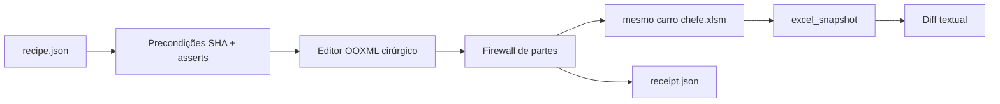

# Excel Recipe V1 — edição transacional do XLSM

## Objetivo

Permitir que agentes proponham alterações na planilha operacional por meio de um roteiro JSON versionado, produzam a mudança em uma branch e entreguem ao proprietário **o mesmo arquivo** `anexos/financeiro/carro chefe.xlsm` atualizado — sem controlar o computador local, sem criar versões paralelas da planilha e sem sobrescrever trabalho local durante a sincronização.

## Arquitetura

O motor usa apenas a biblioteca padrão do Python para modificar o pacote ZIP/XML. Ele **não usa `openpyxl` para salvar o workbook**. Isso é intencional: o arquivo atual contém VBA, ActiveX, gráficos e pivôs, então a V1 só reserializa as partes XML que uma operação declarou como alteráveis.

## Modelo transacional

Toda receita aponta para uma versão exata:

- `expected_sha256`: SHA-256 do `.xlsm` completo;
- `expected_vba_sha256`: SHA-256 do `xl/vbaProject.bin`.

Se a branch base mudou desde a criação da receita, a execução falha antes de editar. Isso funciona como optimistic concurrency control: uma receita não pode ser aplicada silenciosamente sobre um workbook diferente daquele que foi analisado.

## Firewall OOXML

O motor calcula hash de cada entrada do pacote antes e depois. A operação produz uma allowlist de partes que pode modificar. Qualquer mudança fora dessa lista aborta a execução.

Na V1 são sempre imutáveis, mesmo que uma receita tente autorizá-los:

- `xl/vbaProject.bin`;
- `xl/activeX/*`;
- `xl/charts/*`;
- `xl/pivotTables/*`;
- `xl/pivotCache/*`;
- `xl/media/*`.

## Escrita atômica e rollback

As operações são feitas em memória e gravadas primeiro em um arquivo temporário. O candidato é reaberto e o hash do VBA é conferido novamente. Só então substitui a fonte.

No fluxo normal, o snapshot textual é regenerado em seguida. Se essa etapa falhar, o workbook original é restaurado. Nenhum arquivo `v2`, `final`, `backup.xlsx` ou similar é mantido no repositório.

## Tabelas

A V1 manipula Table Parts e células da worksheet de forma coordenada. Ao inserir um registro:

1. procura a primeira linha logicamente vazia da tabela;
2. ignora fórmulas de `calculatedColumnFormula` ao decidir se a linha está vazia;
3. copia o estilo de célula da linha anterior quando cria uma linha nova;
4. reaplica fórmulas calculadas das colunas não fornecidas explicitamente;
5. expande o `ref` da tabela somente se não houver espaço interno disponível.

`delete_rows` limpa o registro em vez de deslocar linhas físicas. Esse limite reduz risco de referências quebradas.

## Fórmulas e recálculo

Alterações de fórmula removem o valor em cache daquela célula e marcam o workbook para recálculo completo na próxima abertura. O motor não tenta reproduzir o mecanismo de cálculo do Excel.

A tradução A1 de `formula.copy` é propositalmente limitada e opt-in. Refactors globais de fórmulas, nomes definidos, referências estruturadas, VBA, gráficos e pivôs ficam fora da V1.

## Fluxo Git recomendado

1. partir da `main` atual;
2. criar `excel/<assunto>` ou branch equivalente;
3. gerar receita com hashes/precondições;
4. executar `validate`/`apply` na branch;
5. revisar o novo snapshot e o receipt;
6. deixar CI validar o motor e o snapshot;
7. abrir PR para `main`;
8. após merge, o proprietário roda `python -m tools.excel_recipe.sync`.

O sync não resolve divergências automaticamente. Se houver edição local da planilha, ele para e exige decisão humana.

## Critérios de pronto da V1

- CRUD de valores/fórmulas;
- CRUD seguro de registros de tabela;
- criar/remover/redimensionar tabela dentro das restrições V1;
- adicionar coluna somente à direita;
- asserts/precondições;
- hashes de fonte e VBA;
- firewall de pacote;
- receipt auditável;
- integração automática com snapshot;
- testes em Linux e Windows no CI;
- sincronização local somente por fast-forward.
