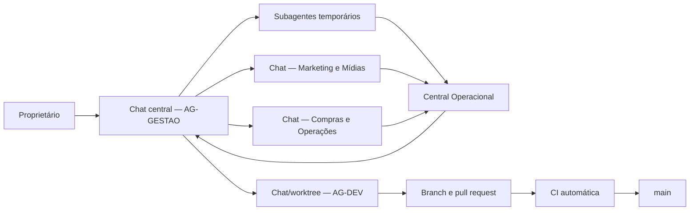

# GitHub e agentes do Carro Chefe

Este documento define como pessoas, chats e subagentes trabalham no mesmo projeto sem perder histórico, sobrescrever arquivos ou publicar algo sem aprovação.

## Decisão recomendada

Use um modelo **híbrido**:

- um chat permanente de **Gestão** coordena prioridades, decisões e integra os resultados;
- chats separados e worktrees atendem frentes longas que alteram código ou muitos ativos;
- subagentes do mesmo chat executam pesquisas, análises e revisões curtas em paralelo;
- GitHub guarda código e documentação; a Central Operacional guarda plano, decisões, riscos, evidências e aprovações.

Não é necessário manter oito chats trabalhando o tempo todo. Comece com Gestão, Development & Data, Marketing & Mídias e Pesquisa & Compras. Acione os demais papéis conforme a entrega exigir.



## O que já está configurado no projeto

- `.codex/config.toml` habilita subagentes, limita a quatro execuções simultâneas e usa um modelo equilibrado por padrão.
- `.codex/agents/` define os agentes `gestao`, `development`, `marketing`, `midias`, `compras`, `operacoes`, `financas` e `marca`.
- `AGENTS.md` contém missão, limites, responsabilidades, critérios de pronto e fluxo de aprovação.
- `.github/workflows/ci.yml` testa a Central Operacional em Node.js 20 e 24.
- `.github/dependabot.yml` verifica semanalmente dependências npm e GitHub Actions.
- templates de issue e pull request padronizam resultado, aceite, impacto, evidência e risco.
- `CODEOWNERS` identifica o proprietário responsável pela aprovação final.

## Como ativar e chamar os agentes no Codex

1. Abra este repositório como projeto confiável no Codex.
2. Inicie uma nova tarefa depois que os arquivos de `.codex/` estiverem na branch visível. Se uma tarefa já estava aberta, reabra o projeto para recarregar a configuração.
3. Peça a delegação explicitamente e nomeie os papéis. Exemplo: `Delegue em paralelo para compras, finanças e operações a análise do refrigerador; não compre nada e consolide uma recomendação.`
4. Mantenha no máximo três subagentes além do coordenador. O limite do projeto é quatro execuções simultâneas.
5. Dê a cada agente uma entrega delimitada e caminhos de escrita diferentes. Um único agente deve ser responsável por cada arquivo ou branch.
6. Exija que o coordenador reúna os resultados, verifique conflitos e registre a proposta na Central Operacional.

Os agentes personalizados têm acesso de escrita ao workspace porque precisam produzir arquivos e testes. Isso não autoriza compra, publicação, deploy, alteração de DNS/ERP, uso de dados pessoais, merge ou push forçado; os limites do `AGENTS.md` continuam valendo.

### Exemplos de pedidos

```text
Use AG-GESTAO como coordenador. Delegue para AG-COMPRAS uma comparação de três freezers
e para AG-FINANCAS o custo total de propriedade. Apenas pesquise e registre uma proposta;
não compre nem contate fornecedores.
```

```text
Use AG-DEV para implementar a tarefa TASK-DEV-001 em branch própria. Depois peça a outro
agente uma revisão somente de leitura. Rode os testes e pare antes de commit, push ou merge
caso eu ainda não os tenha autorizado.
```

## Quando usar outro chat no mesmo projeto

| Situação | Melhor escolha | Motivo |
|---|---|---|
| Pesquisa de produto, revisão ou análise delimitada | Subagente no chat atual | Compartilha o objetivo e devolve uma resposta consolidada rapidamente |
| Implementação que dura vários ciclos | Novo chat com worktree | Mantém contexto e arquivos isolados em branch própria |
| Marketing recorrente ou calendário editorial | Novo chat do papel | Preserva histórico e decisões específicas da frente |
| Duas mudanças no mesmo arquivo | Um chat por vez | Evita conflito e perda de trabalho |
| Decisão que atravessa todas as áreas | Chat central de Gestão | Mantém uma única prioridade e versão da decisão |

Chats diferentes não devem depender da memória uns dos outros. Toda decisão útil precisa terminar em um documento versionado ou em uma requisição da Central Operacional.

## Fluxo obrigatório no GitHub

1. Atualizar a `main` local e criar uma branch por entrega: `dev/...`, `marketing/...`, `midias/...`, `compras/...` ou `chore/...`.
2. Alterar apenas o escopo atribuído e executar os testes proporcionais.
3. Revisar a lista de arquivos modificados; nunca incluir `.env`, `.runtime/`, uploads ou segredos.
4. Criar commit pequeno e descritivo somente após autorização.
5. Enviar a branch e abrir um pull request em rascunho somente após autorização.
6. Esperar o CI ficar verde, resolver comentários e fazer merge por squash.
7. Apagar a branch remota depois do merge.

`main` é integração, não área de trabalho. Push forçado e reescrita de histórico são proibidos.

## Acessos e credenciais

Há três acessos separados:

1. **Git local:** o Gerenciador de Credenciais do sistema autentica a conta proprietária. Não copie essa credencial para arquivos ou mensagens.
2. **Conector GitHub do Codex:** a GitHub App precisa receber acesso explícito ao repositório para realizar escritas, mesmo que o conteúdo público possa ser lido sem esse acesso.
3. **GitHub Actions:** os workflows recebem um `GITHUB_TOKEN` efêmero com permissão de leitura por padrão.

Para liberar o repositório ao conector:

1. No GitHub, abra [a instalação atual do aplicativo](https://github.com/settings/installations/152452798) ou siga **Settings → Applications → Installed GitHub Apps**.
2. Configure a aplicação usada pelo Codex/OpenAI.
3. Em **Repository access**, inclua `victorgabriel2v6g8m4s-cmd/carro-chefe` e salve.
4. Se o Codex continuar retornando “not found”, desconecte e reconecte o GitHub nas configurações do aplicativo.
5. Valide primeiro uma leitura da branch `main`; depois teste a criação de uma branch descartável, nunca um push direto na `main`.

Não crie um token pessoal de acesso amplo para “facilitar”. Se uma integração futura realmente exigir token, use escopo mínimo, expiração curta e cofre de segredos.

## Proteção da `main`

Em 12 de agosto de 2026, o proprietário autorizou tornar o repositório público para disponibilizar os controles de branch no plano atual. Conteúdo, estratégia e ativos presentes no Git passam a ser visíveis e podem ser indexados; segredos, dados pessoais desnecessários, custos confidenciais e credenciais continuam proibidos.

A `main` deve manter:

- pull request obrigatório;
- CI obrigatório em Node.js 20 e 24;
- bloqueio de deleção e force push;
- resolução obrigatória de conversas;
- histórico linear;
- nenhuma exceção permanente para agentes.

Mesmo com o repositório público, os ativos de marca não recebem licença de reutilização automática. Consulte `NOTICE.md`.

## Política de modelos e custo

- `gpt-5.6-sol` com raciocínio alto: Gestão, Development e Finanças, quando a decisão é complexa ou de maior risco.
- `gpt-5.6-terra`: Marketing, Mídias, Compras, Operações e Marca, com boa relação entre qualidade e custo para pesquisa e produção cotidiana.
- Quatro execuções simultâneas são o teto, não a meta. Paralelize somente trabalhos independentes.

## Checklist para adicionar um novo agente

1. Definir responsabilidade exclusiva e entregável mensurável.
2. Criar `.codex/agents/<nome>.toml` com nome, descrição, modelo, raciocínio e instruções.
3. Adicionar o papel e seus limites ao `AGENTS.md`.
4. Informar quais arquivos ele pode alterar e quais aprovações continuam humanas.
5. Testar com uma tarefa pequena e reversível.
6. Revisar qualidade, custo, conflitos e necessidade real antes de torná-lo recorrente.

## Próxima evolução

Quando o site e o ERP estiverem definidos, acrescentar ambientes `preview` e `production`, deploy com aprovação humana, varredura de segurança compatível com o plano do GitHub, backup e monitoramento. Nenhuma credencial de produção deve ser configurada antes de existir fornecedor, domínio e política de acesso aprovados.

## Referências oficiais

- [Subagentes no Codex](https://learn.chatgpt.com/docs/agent-configuration/subagents)
- [Worktrees no Codex](https://learn.chatgpt.com/docs/environments/git-worktrees)
- [Opções do Dependabot](https://docs.github.com/en/code-security/dependabot/working-with-dependabot/dependabot-options-reference)
- [Rulesets do GitHub](https://docs.github.com/en/repositories/configuring-branches-and-merges-in-your-repository/managing-rulesets/about-rulesets)
- [Permissões do `GITHUB_TOKEN`](https://docs.github.com/en/actions/security-for-github-actions/security-guides/automatic-token-authentication)
