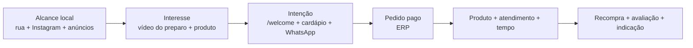

# Marketing, mídias e lançamento

## Posicionamento inicial

**Carro Chefe é o espeto que vira lanche de assinatura, preparado diante do cliente em um quiosque colonial de esquina.**

Pilares de mensagem:

- **produto protagonista:** brasa, textura, montagem e escolha do espeto;
- **ritual visível:** parrilla e preparo como prova de sabor;
- **personalização simples:** escolha que não trava a fila;
- **identidade memorável:** jipe-chef, madeira, bronze e “Sabor que lidera”;
- **conveniência local:** pedido no totem, atendimento ou site.

As alegações devem ser verdadeiras e demonstráveis. Evitar “o melhor”, “artesanal”, “premium” ou promessas de tempo sem critério definido.

## Público e raio

Hipóteses a validar por observação e vendas:

- moradores e trabalhadores próximos buscando jantar/lanche;
- pessoas que já consomem espetinho/churrasco, mas querem formato prático;
- grupos atraídos pelo Chefão e por conteúdo visual;
- clientes de passagem impactados pela fachada, cheiro e parrilla visível.

Tráfego pago deve começar com raio pequeno, horários em que a operação tem capacidade e exclusão de zonas sem atendimento. O ERP precisa distinguir pedido pago de mero clique.

## Funil

Métrica principal por estágio:

- alcance qualificado/visualização completa;
- clique para cardápio e visualização de produto;
- conversão em pagamento aprovado;
- margem por pedido e tempo de preparo;
- recompra e avaliação.

## Plano de lançamento

### Pré-abertura

- apresentar a marca e o “carro que virou chef”;
- bastidores do quiosque, madeira, metal, parrilla e testes;
- revelar cada produto somente após ficha/foto aprovadas;
- captar interessados pelo Instagram/WhatsApp com consentimento;
- anunciar data apenas quando G3 e G4 estiverem aprovados.

### Soft opening

- convite controlado por janela/quantidade;
- conteúdo registra o preparo real e feedback autorizado;
- mídia paga limitada ao volume que a operação consegue entregar;
- oferta não pode mascarar CMV ou criar fila insegura.

### Primeiros 30 dias

- campanha principal do Carro‑Chefe, com Chefão como peça de escala/compartilhamento;
- remarketing para quem abriu cardápio sem comprar, quando juridicamente e tecnicamente permitido;
- campanha de recompra baseada em intervalo real, consentimento e margem;
- testes A/B de criativo/oferta, sem alterar várias variáveis ao mesmo tempo;
- pausa automática/manual quando ERP indicar ruptura ou saturação.

## Calendário editorial inicial

| Pilar | Formatos | Frequência indicativa | Objetivo |
|---|---|---|---|
| Produto | macro, corte, montagem, ASMR | 2–3/semana | desejo e compreensão |
| Bastidores | parrilla, preparação, quiosque | 2/semana | confiança e identidade |
| Escolha | espeto/adicionais/combinações | 1–2/semana | reduzir dúvida |
| Prova social | reação, avaliação, UGC autorizado | 1/semana | credibilidade |
| Serviço | horário, localização, pedido | stories recorrentes | conversão |

Frequências são ponto de partida e devem ceder à qualidade e capacidade de produção.

## Biblioteca de mídia

Metadados obrigatórios: data, autor, produto, canal, formato, versão, status de aprovação, direitos/consentimento, campanha e data de expiração quando houver.

Nomenclatura: `AAAA-MM-DD_pilar-assunto_formato_vNN_status.ext`.

Status: `draft`, `review`, `approved`, `published`, `retired`.

## Etiqueta e QR code

Conteúdo mínimo proposto:

- logo legível;
- `carrochefe.com` e QR code com destino controlado;
- Instagram `@carrochefe_cg`;
- WhatsApp `(67) 9 9204-6721`;
- área segura e contraste suficientes para leitura.

Antes de imprimir em lote: testar QR em Android/iPhone, luz baixa, embalagem curva e distâncias reais; definir UTM/redirecionamento para trocar destino sem reimpressão; revisar informações obrigatórias da embalagem com profissional.

## Governança de campanha

Cada campanha registra: hipótese, público, canal, criativos, período, orçamento máximo, oferta, capacidade disponível, UTMs, evento de conversão, margem esperada, regra de pausa e responsável.

Nenhum resultado é declarado incremental sem método. Começar comparando períodos/células equivalentes e evoluir para testes geográficos ou de holdout quando o volume permitir.

