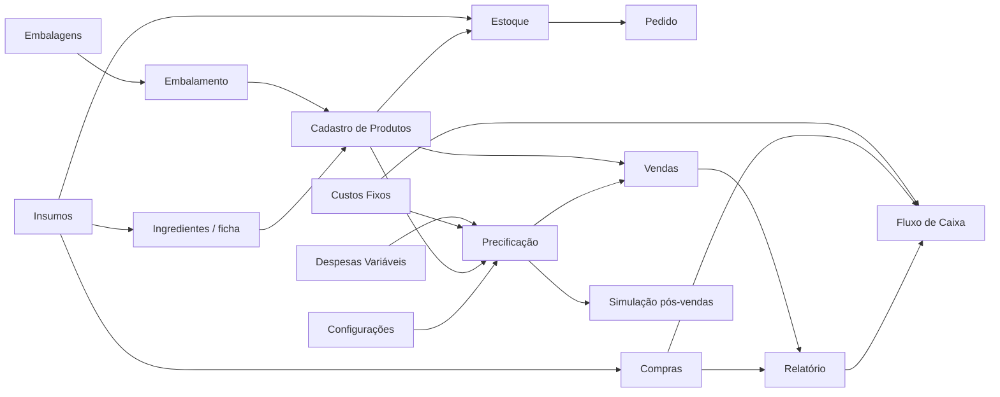

# Planilha operacional e financeira

Este documento descreve a planilha macro-enabled originalmente recebida como `cantindatapioca.xlsm`. A cópia local foi versionada como `anexos/financeiro/carro chefe.xlsm`, como referência operacional, financeira e de migração do **Carro Chefe**.

> **Governança:** a planilha não substitui o ERP. Conforme `AGENTS.md` e `docs/DADOS_ERP.md`, o ERP deverá ser a fonte oficial de produtos, preços, estoque, pedidos, pagamentos, fiscal e financeiro. Esta planilha serve como referência de lógica, cadastros, simulações, histórico legado e apoio à migração/validação.

## 1. Identificação do arquivo

| Campo | Valor |
| --- | --- |
| Arquivo no repositório | [`anexos/financeiro/carro chefe.xlsm`](../anexos/financeiro/carro%20chefe.xlsm) |
| Nome de origem | `cantindatapioca.xlsm` |
| Formato | Microsoft Excel Macro-Enabled Workbook (`.xlsm`) |
| Tamanho da versão inicial | 246.785 bytes |
| SHA-256 da versão inicial | `ee5f0bd1319279e64998c6b3c5faff9ae73323f1e0e0b6133f7c09f8aaae7313` |
| Criador registrado no arquivo | `Datwork` |
| Última modificação registrada na versão inicial | 2026-09-11 16:19:10 UTC |
| Tamanho da cópia local versionada em 2026-09-14 | 246.827 bytes |
| SHA-256 da cópia local versionada em 2026-09-14 | `62ceecb5d1349c4b27c37a901bae00aa1ac63884f5d5fe7f3990ad6f33073b70` |
| Última modificação registrada na cópia local | 2026-09-11 16:21:37 UTC |
| Abas visíveis | 16 |
| Tabelas estruturadas | 21 |
| Recursos especiais | VBA, controles ActiveX, tabela dinâmica, gráficos, fórmulas e referências estruturadas |

A extensão `.xlsm` deve ser preservada. Salvar o arquivo como `.xlsx` remove o projeto VBA e pode inutilizar partes da automação.

## 2. Finalidade

A planilha concentra uma cadeia operacional completa para uma pequena operação de alimentação:

1. parâmetros gerais de vendas, precificação, medidas e recebimentos;
2. cadastro e normalização de insumos e embalagens;
3. composição de receitas/fichas e custo de embalamento;
4. cadastro e custo de produtos;
5. estoque, compras e necessidade de pedido;
6. custos fixos e despesas variáveis;
7. precificação e simulação de resultado;
8. lançamento de vendas e recebimentos;
9. relatórios gerenciais e fluxo de caixa.

A versão recebida já contém itens relacionados ao Carro Chefe, incluindo **Carro Chefe Simples**, **Carro Chefe Com Cheddar** e **Chefão**. Os nomes, custos, margens, percentuais e demais valores existentes no arquivo devem ser tratados como dados legados ou hipóteses até validação pela Gestão/Finanças. Eles não passam a ser parâmetros oficiais apenas por estarem na planilha.

## 3. Fluxo lógico

A dependência entre abas é significativa. Alterar nomes de tabelas, cabeçalhos, IDs, unidades ou intervalos sem revisar as fórmulas pode quebrar cálculos em cascata.

## 4. Abas

| Aba | Função principal | Observações |
| --- | --- | --- |
| `configurações` | Parâmetros globais | Metas de vendas/faturamento, rateio, margens ABC, despesas variáveis, medidas e métodos de recebimento. |
| `ingredientes` | Ficha/composição dos produtos | Relaciona produto, ID, item, quantidade, medida, porções e custo do componente. |
| `Embalamento` | Embalagem por produto | Liga produto a embalagem, quantidade, medida e preço/custo correspondente. |
| `Embalagens` | Cadastro de embalagens | Normaliza preço de compra por unidade, kg, g, L e mL quando aplicável. |
| `insumos` | Cadastro de insumos | Base de matérias-primas e respectivos preços, quantidades, medidas e conversões. |
| `Cadastro de Produtos` | Cadastro e custo dos produtos | Consolida ingredientes + embalagem, custo de lote, unidade e custo total. |
| `Estoque` | Controle/estimativa de estoque | Relaciona IDs, quantidade por pacote, quantidade disponível, estimativa e medida. |
| `Pedido` | Necessidade de reposição | Calcula pedido mínimo, arredondamento e valor total a partir da produção/consumo. |
| `Custos Fixos` | Custos recorrentes | Mantém descrição, valor e participação percentual. |
| `Despesas Variáveis` | Percentuais variáveis | Registra itens percentuais considerados no custo/resultado. |
| `Precificação` | Formação de preço | Usa custo, categorias ABC, margens, preço definitivo, lucro bruto/líquido e rateio de custos fixos. |
| `simulação pós-vendas` | Cenários de resultado | Simula quantidade vendida, faturamento, lucro e rateio de custos. |
| `Compras` | Lançamento de compras | Data, ID, item, quantidade, medida e valor. |
| `Vendas` | Lançamento de vendas | Produto, adicionais, quantidade, valor, método de pagamento, recebimento e lucro. |
| `Relatório` | Consolidação gerencial | Resumos financeiros, consumo, análises e tabela dinâmica/gráficos. |
| `Fluxo de Caixa` | Consolidação temporal | Investimentos, pró-labore, entradas, saídas, faturamento, lucros, reestoque, custos e caixa acumulado. |

## 5. Tabelas estruturadas relevantes

A planilha usa referências estruturadas do Excel. Entre as tabelas detectadas estão:

- `PrevVendas`: máximo/mínimo de vendas e faturamento-alvo/mínimo;
- `ConfPrec`: rateio de custos fixos, despesas variáveis e margens por categoria;
- `Variáveis`: catálogo de medidas;
- `métodos`: métodos de pagamento, desconto e acréscimo;
- `Ingredientes`: composição das fichas;
- `Embalamento`: vínculo entre produto e embalagem;
- `Embalagens`: cadastro e conversão de embalagens;
- `insumos`: cadastro e conversão de insumos;
- `CaProdutos`: cadastro consolidado dos produtos;
- `estoque`: posições/estimativas de estoque;
- `compras`: registros de compras;
- `vendas`: registros de vendas;
- `CFMensais`: custos fixos mensais;
- `DespesasVariaveis`: despesas percentuais;
- `Precificação`: formação de preço e margem;
- `retorno`: simulação pós-vendas;
- `relatório`: consolidação financeira;
- `Tabela19`: fluxo de caixa.

Existe ainda o nome definido `ListaItensFicha`, com fórmula baseada em `EMPILHARV(insumos[item],CaProdutos[Item])`. Isso indica dependência de funções de matriz dinâmica disponíveis em versões recentes do Microsoft Excel.

## 6. Lógica de cálculo

### 6.1 Insumos e embalagens

As abas `insumos` e `Embalagens` transformam preço e quantidade de compra em valores normalizados. As fórmulas distribuem o custo entre unidades e medidas equivalentes, permitindo que uma ficha técnica use gramas, mililitros, unidades etc. sem repetir manualmente o custo unitário.

### 6.2 Ficha técnica

`ingredientes` busca IDs, medidas e preços nas bases de insumos/produtos e calcula o custo de cada componente pela quantidade utilizada. A lógica permite que um item de produto também participe de outra composição.

### 6.3 Custo do produto

`Cadastro de Produtos` agrega os componentes da ficha, calcula custo de lote e custo por unidade e acrescenta o custo de embalagem/embalamento. Esse resultado alimenta a precificação e a apuração de lucro.

### 6.4 Precificação

`Precificação` usa os custos consolidados, categorias ABC, margens, despesas variáveis e opção de rateio dos custos fixos. O arquivo também admite um preço definitivo/override, portanto o preço calculado e o preço praticado podem divergir.

### 6.5 Vendas e recebimentos

`Vendas` relaciona produto e adicionais, calcula recebimento conforme método de pagamento e seus descontos/acréscimos e deriva lucro bruto/líquido. Métodos e taxas ficam parametrizados em `configurações`.

### 6.6 Compras, estoque e pedido

`Compras` registra reposições; `Estoque` consolida quantidades/medidas; `Pedido` estima necessidade mínima de compra com base na produção e no consumo previsto, com regras de arredondamento.

### 6.7 Relatório e fluxo de caixa

`Relatório` agrega vendas, lucros, reestoque e custos e contém recursos de análise, incluindo tabela dinâmica e gráficos. `Fluxo de Caixa` consolida eventos por data e acumula entradas, saídas e posições financeiras.

## 7. VBA e ActiveX

O arquivo contém `xl/vbaProject.bin` e controles ActiveX. A inspeção estática identificou pelo menos:

- módulo `modAutocompleteFicha`;
- eventos `Workbook_Open`, `Workbook_BeforeClose` e `Workbook_SheetSelectionChange`;
- manipuladores como `mCombo_Click`, `mCombo_DropButtonClick`, `mBotao_Click` e `mLista_Click`;
- rotina `SalvarValorAtualDoEditor`;
- referências a `CaProdutos`, `Worksheet`, `ThisWorkbook` e `CommandButton`.

A presença dessas rotinas sugere automação de interface/autocomplete e interação com controles. Esta documentação não equivale a uma auditoria linha a linha do VBA.

### Regras de segurança para macros

- execute macros somente em cópias provenientes deste repositório/fluxo de confiança;
- não habilite macros em arquivos recebidos novamente por fontes desconhecidas;
- para uso corporativo recorrente, revisar o VBA e considerar assinatura digital do projeto;
- ActiveX é dependente do Excel Desktop no Windows e não funciona de forma equivalente no Excel para Web, Google Sheets ou outras suítes;
- alterações em controles, nomes de tabelas ou eventos devem ser testadas no Excel Desktop antes de publicar nova versão.

## 8. Compatibilidade recomendada

Use **Microsoft Excel Desktop recente, preferencialmente Microsoft 365 no Windows**. Motivos:

- o arquivo possui macros VBA;
- há controles ActiveX;
- existem referências estruturadas e funções de matriz dinâmica;
- há tabela dinâmica e gráficos;
- mecanismos alternativos podem preservar células, mas não necessariamente automações e recálculo.

Não use conversão por Google Sheets/LibreOffice como fluxo de edição oficial se for necessário manter fidelidade total ao `.xlsm`.

## 9. Como operar a planilha

Fluxo recomendado para manutenção manual:

1. abrir uma cópia de trabalho no Excel Desktop;
2. revisar `configurações` antes de qualquer simulação;
3. atualizar `insumos` e `Embalagens` com preço, quantidade e medida da compra;
4. manter as fichas em `ingredientes` e o vínculo de embalagem em `Embalamento`;
5. conferir o custo consolidado em `Cadastro de Produtos`;
6. revisar custos fixos e despesas variáveis;
7. validar `Precificação` e somente então definir eventual preço definitivo;
8. registrar compras e vendas sem alterar cabeçalhos/tabelas;
9. conferir `Estoque`, `Pedido`, `Relatório` e `Fluxo de Caixa`;
10. forçar recálculo completo no Excel e revisar erros antes de salvar uma nova versão.

## 10. Valores existentes não são automaticamente oficiais

Na versão inicial foram encontrados, entre outros, parâmetros como metas de vendas/faturamento, margens por categoria, percentuais de despesas e custos fixos. Esses números devem permanecer identificados como **estado da planilha no momento da importação**, não como decisão aprovada da empresa.

Exemplo: a planilha contém custos e preços calculados para itens do Carro Chefe e percentuais configurados para água, energia, gás, cartão, desperdício etc. Antes de qualquer uso gerencial, financeiro ou comercial, AG-FINANCAS/Gestão deve validar origem, data, unidade e aplicabilidade de cada valor.

## 11. Qualidade e limitações da inspeção

A inspeção automatizada confirmou a estrutura do pacote Excel, tabelas, fórmulas, VBA/ActiveX e metadados. Ferramentas headless não reproduzem integralmente o motor do Excel e podem apresentar `#NAME?`, `#VALUE!` ou `#N/A` ao tentar recalcular referências estruturadas, funções localizadas, matrizes dinâmicas, tabelas dinâmicas ou dependências de macro.

Isso **não prova que a planilha original esteja quebrada**. O critério de validação funcional é abrir a mesma versão no Microsoft Excel Desktop, atualizar/recalcular e verificar as abas dependentes.

Checklist mínimo de validação:

- abrir sem aviso de corrupção;
- confirmar que VBA/controles carregam quando habilitados;
- executar recálculo completo;
- revisar fórmulas com erro;
- testar seleção/autocomplete e controles ligados ao VBA;
- atualizar tabela dinâmica e gráficos;
- comparar custo de ao menos três produtos manualmente;
- comparar uma compra, uma venda e uma linha de fluxo de caixa com cálculo independente;
- conferir se totais de vendas e recebimentos fecham com o método de pagamento;
- validar unidades de medida e conversões.

## 12. Segurança, privacidade e repositório público

Este repositório é público. A versão inicial inspecionada não apresentou credenciais, tokens ou dados pessoais evidentes nos metadados examinados, mas contém informações operacionais e financeiras que podem ser comercialmente sensíveis.

Antes de versionar futuras cópias:

- remover clientes, telefones, endereços, documentos, dados bancários e qualquer dado pessoal desnecessário;
- nunca incluir senhas, tokens, chaves, dados de cartão ou segredos;
- revisar se custos, fornecedores ou condições comerciais podem ser publicados;
- preferir dados anonimizados/de teste em versões destinadas ao GitHub;
- manter o arquivo operacional vivo fora do Git quando passar a acumular dados reais sensíveis.

## 13. Versionamento

Arquivos `.xlsm` são binários; o Git não produz um diff semântico confiável entre versões. Para cada atualização relevante:

1. preservar a extensão `.xlsm`;
2. registrar em PR/commit o motivo da alteração;
3. informar quais abas/tabelas foram alteradas;
4. registrar a nova soma SHA-256 quando a versão se tornar uma referência importante;
5. manter uma cópia anterior até a nova versão ser validada;
6. não sobrescrever silenciosamente uma versão validada com dados experimentais;
7. evitar incluir transações reais contínuas no Git.

## 14. Migração para o ERP

A planilha é útil como fonte de **levantamento e migração**, mas os modelos devem ser normalizados antes de importar para o ERP.

Mapeamento conceitual recomendado:

| Planilha | Destino conceitual no ERP/modelo de dados |
| --- | --- |
| `insumos` | `INGREDIENT` / cadastro de matéria-prima |
| `Embalagens` | ingrediente/embalagem ou item de estoque |
| `ingredientes` | `RECIPE_ITEM` / ficha técnica / BOM |
| `Cadastro de Produtos` | `PRODUCT` |
| adicionais em produtos/vendas | `MODIFIER` / `ITEM_MODIFIER` |
| `Compras` | `PURCHASE` / `PURCHASE_ITEM` |
| `Estoque` | posição inicial + `STOCK_MOVEMENT` |
| `Vendas` | histórico de `ORDER` / `ORDER_ITEM` / pagamento, quando houver dados suficientes |
| `Precificação` | versão de custo/preço para validação, não histórico transacional definitivo |
| `Fluxo de Caixa` | relatório de conciliação, não razão transacional principal |

Na migração, não usar os IDs numéricos locais da planilha como identificadores canônicos sem revisão. O projeto adota IDs estáveis e legíveis, como `PROD-*`, `MOD-*` e `ING-*`.

### Procedimento sugerido de migração

1. congelar uma versão aprovada da planilha;
2. extrair tabelas para formato intermediário (CSV/JSON) sem macros;
3. normalizar grafias, unidades, categorias e duplicidades;
4. criar o mapeamento entre IDs legados e IDs canônicos;
5. validar fichas, rendimentos, custos e preços com Finanças/Operações;
6. importar em ambiente de teste do ERP;
7. reconciliar quantidades e valores com a planilha congelada;
8. somente então promover os cadastros ao ambiente oficial;
9. arquivar a planilha como evidência de origem, sem manter sincronização bidirecional manual.

## 15. Relação com a arquitetura do Carro Chefe

A planilha deve ser entendida como uma referência histórica/operacional dentro da arquitetura maior:

- `AGENTS.md`: governança e fontes oficiais;
- `docs/DADOS_ERP.md`: modelo de dados, requisitos de ERP, integrações e métricas;
- `docs/PRODUTO_CARDAPIO.md`: catálogo e regras de produto;
- `docs/OPERACAO.md`: operação física e qualidade;
- `apps/gestao/` e `apps/api/`: Central Operacional, decisões, auditoria e coordenação;
- ERP futuro: fonte transacional oficial.

## 16. Histórico desta documentação

### 2026-09-14 — inclusão da cópia local

- arquivo `anexos/financeiro/carro chefe.xlsm` incluído sem conversão ou alteração de conteúdo;
- caminho, tamanho, SHA-256 e data interna de modificação da cópia local registrados;
- leitura do pacote Excel concluída sem falhas, com 16 abas, 21 tabelas e projeto VBA presente;
- a cópia local difere da versão inicial em tamanho e SHA-256; diferenças de células, fórmulas e macros não foram analisadas nesta entrega;
- validação funcional no Excel e recálculo não foram realizados nesta etapa de versionamento.

### 2026-09-11 — versão inicial

- planilha recebida e inspecionada sem conversão;
- estrutura de 16 abas documentada;
- 21 tabelas estruturadas identificadas;
- presença de VBA, ActiveX, tabela dinâmica e gráficos registrada;
- SHA-256 da versão inicial registrado;
- papel da planilha na governança e futura migração para ERP definido.
