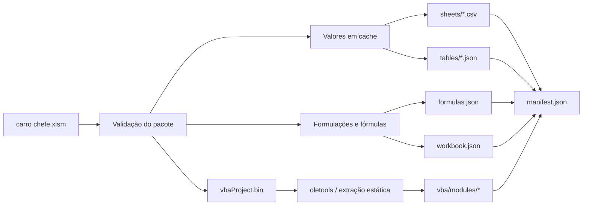

# Snapshot automatizado do XLSM

## Objetivo

O arquivo `anexos/financeiro/carro chefe.xlsm` é binário e não produz um diff semântico útil no Git. Para tornar a planilha auditável por agentes e revisores, o projeto conta com `tools/excel_snapshot/export.py`, uma ferramenta de manutenção que gera uma cópia textual determinística do conteúdo relevante.

A ferramenta não substitui o Excel, não executa VBA e não faz parte do runtime do produto.

## Arquitetura



## Estrutura versionada

O snapshot real já foi materializado e o diretório versionado tem a forma:

```text
anexos/financeiro/
├── carro chefe.xlsm
└── snapshot/
    ├── README.md
    ├── manifest.json
    ├── workbook.json
    ├── formulas.json
    ├── sheets/
    │   └── <aba>.csv
    ├── tables/
    │   └── <tabela>.json
    └── vba/
        ├── index.json
        └── modules/
            ├── <modulo>.bas
            ├── <classe>.cls
            └── <form>.frm
```

A primeira materialização registrou 16 abas, 21 tabelas, 5.830 fórmulas e 19 módulos VBA extraídos.

## Leitura por agentes

Para análise automatizada, agentes e revisores devem preferir os artefatos textuais do snapshot em vez de tentar interpretar diretamente o binário `.xlsm`:

- `tables/*.json` para tabelas estruturadas e relações de dados;
- `sheets/*.csv` para leitura integral das abas;
- `formulas.json` para fórmulas e valores em cache;
- `workbook.json` para estrutura, nomes definidos e metadados;
- `vba/modules/*` para o código-fonte VBA extraído estaticamente.

O `.xlsm` continua sendo a fonte binária original. O snapshot é uma projeção auditável e deve corresponder exatamente à fonte indicada em `manifest.json`.

## VBA e macros

A presença de macros é tratada como dado a ser auditado, não como código a ser executado pelo exportador. O script:

- calcula o SHA-256 de `xl/vbaProject.bin`;
- usa `oletools.olevba.VBA_Parser` para descompactar o código VBA;
- salva cada módulo textual em `snapshot/vba/modules/`;
- registra nome original, stream, tamanho e SHA-256 em `snapshot/vba/index.json`;
- normaliza apenas quebras de linha e codificação textual para produzir diffs estáveis;
- nunca chama Excel, COM, `Application.Run`, PowerShell ou qualquer mecanismo de execução de macro.

Assim, um agente pode ler `ThisWorkbook`, módulos padrão, módulos de planilha, classes e UserForms sem precisar interpretar o binário `.xlsm`.

Limite conhecido: recursos binários de UserForms e controles ActiveX não são convertidos para uma representação visual. Eles continuam dentro do `.xlsm`; o snapshot registra o código associado e a integridade do projeto VBA.

## Integridade e determinismo

`manifest.json` liga o snapshot à fonte por SHA-256. Também registra hashes de todos os artefatos gerados. Isso evita que um agente use um snapshot antigo sem perceber que o binário mudou.

O gerador omite timestamp variável para manter a saída determinística. A data da atualização deve ser obtida do commit/PR no Git.

Os artefatos em `anexos/financeiro/snapshot/**` são forçados a `LF` por `.gitattributes`. Essa regra é parte do determinismo entre Windows e Linux: o modo `--check` compara os arquivos byte a byte, portanto conversões automáticas para `CRLF` fariam um snapshot correto parecer divergente.

## Bootstrap inicial — concluído

O bootstrap existiu somente para permitir a introdução segura da ferramenta antes da primeira materialização do snapshot. O marcador `snapshot/BOOTSTRAP_REQUIRED.json` ficou preso ao SHA-256 exato da fonte e só era aceito enquanto `manifest.json` ainda não existia.

A primeira exportação real já foi concluída para a fonte de SHA-256 `62ceecb5d1349c4b27c37a901bae00aa1ac63884f5d5fe7f3990ad6f33073b70`. O marcador foi removido e o snapshot completo foi versionado.

A partir desse estado, o fluxo normal e o CI usam verificação estrita com:

```bash
python tools/excel_snapshot/export.py --check
```

A ausência ou divergência do snapshot é erro. O parâmetro `--allow-bootstrap` permanece implementado apenas como mecanismo histórico/controlado da ferramenta e não faz parte do fluxo normal após a materialização inicial.

## Dependências

As bibliotecas ficam em `tools/excel_snapshot/requirements.txt` e são instaladas em ambiente Python isolado no job de CI. Elas não são incluídas nas dependências Node nem no deploy de produção.

Dependências diretas:

- `openpyxl`: leitura estrutural do workbook e fórmulas;
- `oletools`: extração estática do código VBA.

## CI

O job `Workbook Snapshot` em `.github/workflows/ci.yml` usa permissões somente de leitura, cria um `venv` dentro de `.runtime`, instala apenas as dependências da ferramenta, executa os testes e depois executa `tools/excel_snapshot/export.py --check`.

O job não altera o repositório, não faz commit automático e não publica artefatos. A decisão de atualizar e versionar o snapshot continua explícita no PR.

## Relação com o ERP

O snapshot existe para auditoria, migração e leitura por agentes. Ele não cria sincronização bidirecional com a planilha e não compete com o ERP. Quando o ERP assumir produtos, preços, estoque, pedidos, pagamentos e financeiro, esses dados transacionais continuam sob a governança definida em `AGENTS.md`.
