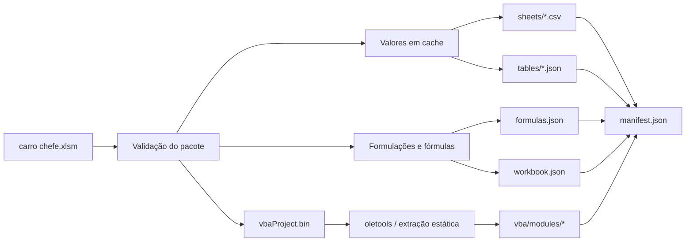

# Snapshot automatizado do XLSM

## Objetivo

O arquivo `anexos/financeiro/carro chefe.xlsm` é binário e não produz um diff semântico útil no Git. Para tornar a planilha auditável por agentes e revisores, o projeto passa a contar com `tools/excel_snapshot/export.py`, uma ferramenta de manutenção que gera uma cópia textual determinística do conteúdo relevante.

A ferramenta não substitui o Excel, não executa VBA e não faz parte do runtime do produto.

## Arquitetura



## Estrutura versionada

Depois da primeira exportação real, o diretório terá a forma:

```text
anexos/financeiro/
├── carro chefe.xlsm
└── snapshot/
    ├── README.md
    ├── manifest.json
    ├── workbook.json
    ├── formulas.json
    ├── sheets/
    │   └── <aba>.csv
    ├── tables/
    │   └── <tabela>.json
    └── vba/
        ├── index.json
        └── modules/
            ├── <modulo>.bas
            ├── <classe>.cls
            └── <form>.frm
```

## VBA e macros

A presença de macros é tratada como dado a ser auditado, não como código a ser executado pelo exportador. O script:

- calcula o SHA-256 de `xl/vbaProject.bin`;
- usa `oletools.olevba.VBA_Parser` para descompactar o código VBA;
- salva cada módulo textual em `snapshot/vba/modules/`;
- registra nome original, stream, tamanho e SHA-256 em `snapshot/vba/index.json`;
- normaliza apenas quebras de linha e codificação textual para produzir diffs estáveis;
- nunca chama Excel, COM, `Application.Run`, PowerShell ou qualquer mecanismo de execução de macro.

Assim, um agente pode ler `ThisWorkbook`, módulos padrão, módulos de planilha, classes e UserForms sem precisar interpretar o binário `.xlsm`.

Limite conhecido: recursos binários de UserForms e controles ActiveX não são convertidos para uma representação visual. Eles continuam dentro do `.xlsm`; o snapshot registra o código associado e a integridade do projeto VBA.

## Integridade

`manifest.json` liga o snapshot à fonte por SHA-256. Também registra hashes de todos os artefatos gerados. Isso evita que um agente use um snapshot antigo sem perceber que o binário mudou.

O gerador omite timestamp variável para manter a saída determinística. A data da atualização deve ser obtida do commit/PR no Git.

## Bootstrap inicial

No momento de introdução da ferramenta, o snapshot ainda precisa ser materializado a partir do binário. Para não transformar essa etapa em uma brecha permanente, `snapshot/BOOTSTRAP_REQUIRED.json` contém o SHA-256 exato da versão atual.

O CI aceita esse marcador apenas enquanto:

1. `manifest.json` ainda não existir;
2. a fonte for exatamente o arquivo indicado no marcador;
3. o SHA-256 atual for exatamente o registrado;
4. o exportador conseguir processar todo o workbook em diretório temporário.

A primeira execução normal de `export.py` substitui o diretório e remove o marcador. A partir daí, a ausência ou divergência do snapshot é erro de CI.

## Dependências

As bibliotecas ficam em `tools/excel_snapshot/requirements.txt` e são instaladas em ambiente Python isolado no job de CI. Elas não são incluídas nas dependências Node nem no deploy de produção.

Dependências diretas:

- `openpyxl`: leitura estrutural do workbook e fórmulas;
- `oletools`: extração estática do código VBA.

## CI

O job `Workbook Snapshot` em `.github/workflows/ci.yml` usa permissões somente de leitura, cria um `venv` dentro de `.runtime`, instala apenas as dependências da ferramenta, executa os testes e depois executa o modo de verificação.

O job não altera o repositório, não faz commit automático e não publica artefatos. A decisão de atualizar e versionar o snapshot continua explícita no PR.

## Relação com o ERP

O snapshot existe para auditoria, migração e leitura por agentes. Ele não cria sincronização bidirecional com a planilha e não compete com o ERP. Quando o ERP assumir produtos, preços, estoque, pedidos, pagamentos e financeiro, esses dados transacionais continuam sob a governança definida em `AGENTS.md`.
