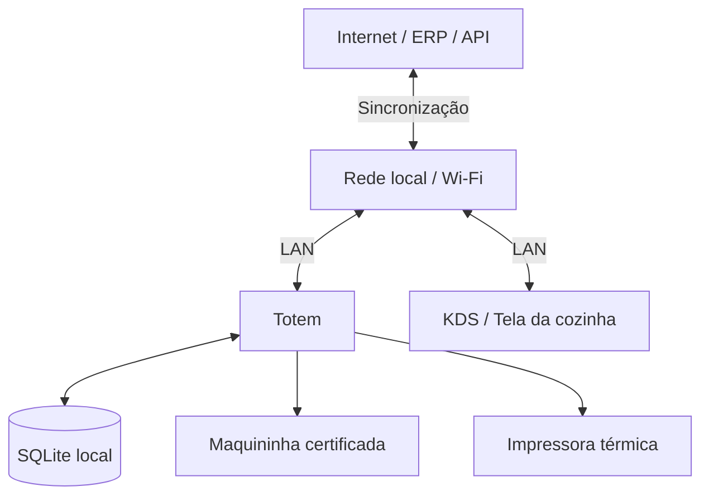
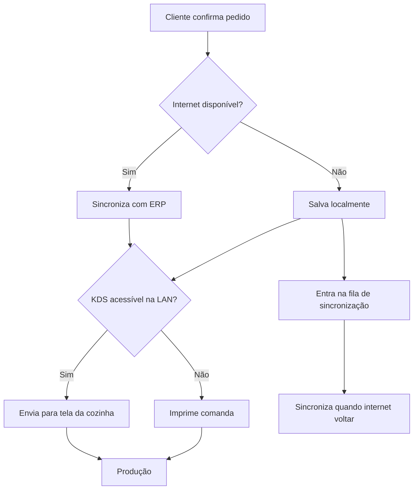
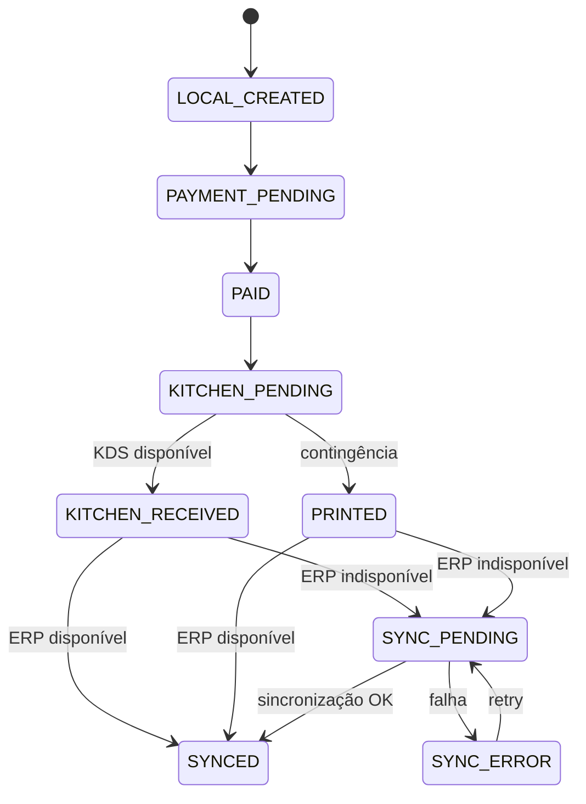
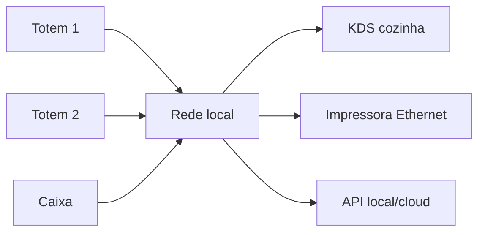

# Totem de Autoatendimento — Planejamento V1

> Documento de referência para hardware, arquitetura offline-first, contingência, orçamento e evolução do totem do **Carro Chefe**.

## 1. Objetivo

Construir um totem de autoatendimento compacto, aproximadamente do tamanho de um tablet médio, com o menor custo possível sem comprometer a operação.

O equipamento deve:

- permitir que o cliente monte e confirme o pedido;
- processar pagamento por meio de uma adquirente/maquininha certificada;
- continuar operando quando a internet externa cair;
- manter o pedido salvo localmente até conseguir sincronizar;
- enviar pedidos à tela da cozinha pela rede local sempre que possível;
- imprimir uma comanda como contingência quando a cozinha/rede local estiver indisponível;
- sincronizar os pedidos com o ERP quando a conexão retornar;
- evitar pedidos duplicados durante a sincronização;
- ser modular, reparável e barato de substituir.

## 2. Princípio de arquitetura

O ERP continua sendo a fonte oficial de produtos, preços, pedidos, pagamentos, estoque e financeiro. O totem mantém apenas a cópia necessária para continuar funcionando durante uma indisponibilidade.



### Regra principal

**A queda da internet externa não deve impedir o totem de conversar com a cozinha.**

Totem e KDS devem operar na mesma rede local. A internet é necessária para ERP/cloud, conciliação, analytics e serviços externos, mas não para a comunicação básica dentro da loja.

## 3. Níveis de contingência



### Nível 1 — operação normal

`Totem → ERP/API → KDS cozinha`

### Nível 2 — internet externa caiu

`Totem → banco local → rede local → KDS cozinha`

O pedido fica marcado como pendente de sincronização e é enviado ao ERP posteriormente.

### Nível 3 — rede local/KDS indisponível

`Totem → banco local → impressora térmica → produção`

A comanda impressa é a contingência operacional.

## 4. Hardware recomendado para o V1

### Tela

Alvo:

- 10,1 polegadas;
- touch capacitivo;
- HDMI;
- USB para o touch;
- suporte VESA, preferencialmente 75 × 75;
- resolução suficiente para interface de cardápio em modo retrato ou paisagem.

Referência de custo atual usada no planejamento: **aprox. R$ 890** para monitor touch 10,1" de categoria comercial.

### Computador

Duas opções possíveis.

#### Opção A — melhor alvo de custo

Mini PC / thin client corporativo usado:

- Dell Wyse;
- HP T630/T640;
- Lenovo Tiny antigo;
- Intel NUC antigo;
- mini PC Celeron equivalente.

**Meta de compra: R$ 300–600.**

Vantagens:

- normalmente já possui armazenamento;
- Ethernet e USB disponíveis;
- Linux roda sem dificuldade;
- mais barato quando encontrado usado em bom estado.

#### Opção B — hardware novo e previsível

Raspberry Pi 5 4 GB com fonte, case e armazenamento.

Referência de custo total: **aprox. R$ 1.100** incluindo microSD.

O Raspberry não é automaticamente a opção mais barata no Brasil, mas oferece hardware padronizado, baixo consumo e bom controle sobre o sistema.

### Impressora térmica

Requisitos:

- bobina 80 mm;
- ESC/POS;
- USB;
- preferencialmente Ethernet;
- guilhotina automática.

Faixa considerada:

- genérica: **R$ 250–350**;
- equipamento comercial de marca: **aprox. R$ 500**.

A Ethernet é importante porque permite que, futuramente, caixa, totem e outros terminais compartilhem a mesma impressora.

### Pagamento

Não construir hardware de pagamento próprio.

Usar sempre uma maquininha/adquirente certificada.

O software do Carro Chefe deve abstrair a adquirente:

```ts
interface PaymentProvider {
  createPayment(): Promise<unknown>;
  checkPayment(): Promise<unknown>;
  cancelPayment(): Promise<unknown>;
  refundPayment(): Promise<unknown>;
}
```

Possíveis implementações futuras:

- Mercado Pago;
- PagBank;
- Stone;
- outra adquirente compatível com integração em totem.

**Importante:** funcionamento offline do totem não significa que cartão funcionará offline. Uma maquininha com 4G próprio pode continuar processando pagamento mesmo com a internet da loja indisponível.

## 5. Estrutura física

Para o primeiro protótipo, usar **MDF de 15 mm**.

Características desejadas:

- frente levemente inclinada;
- recorte para monitor touch;
- acesso traseiro para manutenção;
- saída acessível da impressora;
- nicho ou suporte para maquininha;
- grelhas de ventilação;
- fechamento com pequena fechadura;
- cabos e fonte presos internamente;
- suporte VESA ou suporte interno aparafusado.

A estética deve seguir a identidade física do Carro Chefe: madeira, linguagem colonial e detalhes metálicos/ouro fosco. Isso permite que o MDF bem acabado pareça parte intencional do ambiente em vez de apenas uma solução provisória.

## 6. Organização sugerida do software

```text
apps/
  api/
  gestao/
  site/
  totem/
  kitchen/

packages/
  db/
  contracts/
  ui/
  orders/
  payments/
  sync/
```

### Stack sugerida para o totem

```text
Linux
  ↓
Chromium em kiosk mode
  ↓
React/Vite
  ↓
Serviço local
  ↓
SQLite
```

O frontend pode reutilizar padrões e componentes do monorepo atual.

## 7. Modelo offline-first do pedido

O pedido deve receber um identificador único antes de qualquer chamada externa.

Exemplo de estados:

```text
LOCAL_CREATED
PAYMENT_PENDING
PAID
KITCHEN_PENDING
KITCHEN_RECEIVED
PRINTED
SYNC_PENDING
SYNCED
SYNC_ERROR
```



### Idempotência

Cada pedido usa sempre o mesmo `order_id` ao sincronizar. Isso impede que uma reconexão crie o mesmo pedido mais de uma vez.

A API deve usar chave de idempotência ou semântica equivalente a:

```text
PUT /orders/{order_id}
```

## 8. Comanda de contingência

```text
CARRO CHEFE
PEDIDO #A142

1x CHEFÃO
   + bacon
   - cebola
   ponto: ao ponto

1x Coca-Cola

PAGO

11:42
TOTEM-01

⚠ MODO OFFLINE
```

A comanda deve conter, no mínimo:

- número visível do pedido;
- itens;
- modificadores;
- observações relevantes à produção;
- situação de pagamento;
- horário;
- identificação do terminal;
- indicação clara de modo de contingência quando aplicável.

## 9. Orçamento — cenário econômico

Objetivo: aproveitar um mini PC/thin client usado.

| Componente | Valor-alvo |
|---|---:|
| Monitor touch 10,1" | R$ 890 |
| Mini PC/thin client usado | R$ 400 |
| Impressora térmica 80 mm | R$ 300 |
| Maquininha | R$ 200 |
| MDF + acabamento | R$ 250 |
| Cabos, filtro, fixação e elétrica | R$ 100 |
| **Total estimado** | **R$ 2.140** |

Faixa realista de projeto: **R$ 2.100–2.400** por unidade, dependendo principalmente do computador usado e do acabamento.

## 10. Orçamento — cenário com Raspberry Pi novo

| Componente | Estimativa |
|---|---:|
| Monitor touch 10,1" | R$ 892 |
| Raspberry Pi 5 4 GB + case + fonte | R$ 1.045 |
| microSD 64 GB | R$ 75 |
| Impressora térmica 80 mm | R$ 300 |
| Maquininha | R$ 200 |
| Cabo HDMI/micro-HDMI | R$ 25 |
| Filtro/extensão interna | R$ 50 |
| MDF 15 mm | R$ 100 |
| Parafusos/cantoneiras | R$ 30 |
| Fechadura | R$ 20 |
| Ventilação | R$ 20 |
| Acabamento | R$ 80 |
| Suporte VESA | R$ 40–90 |
| Bobinas iniciais | R$ 40 |
| **Subtotal aproximado** | **R$ 2.917–2.967** |

Adicionar margem para frete, variação de preço e pequenas compras.

**Orçamento seguro:** aproximadamente **R$ 3.200**.

> Os valores são referências de planejamento e devem ser cotados novamente antes da compra.

## 11. Ferramentas para fabricação

Não é necessário CNC para o primeiro protótipo.

- furadeira/parafusadeira;
- serra tico-tico;
- brocas para madeira;
- serra copo;
- esquadro;
- régua metálica;
- trena;
- lixas;
- chave Phillips;
- ferro de solda simples;
- multímetro;
- alicate de corte;
- abraçadeiras;
- termo-retrátil.

Para melhorar o acabamento, a frente da carcaça pode ser enviada separadamente para corte CNC, mantendo o restante da construção manual.

## 12. Energia

Para o primeiro protótipo, nobreak não é obrigatório.

Para operação definitiva, considerar proteção para roteador, totem, KDS/tela da cozinha e eventual servidor local.

O objetivo do nobreak é permitir que pedidos já iniciados sejam gravados, impressos e finalizados com segurança e reduzir risco de corrupção do armazenamento.

## 13. Estratégia para múltiplos terminais



Não é necessário instalar uma impressora em cada terminal se houver uma impressora Ethernet compartilhada disponível para contingência.

## 14. Critérios de aceite do protótipo

- [ ] liga sozinho após retorno de energia;
- [ ] abre automaticamente em modo kiosk;
- [ ] cliente consegue montar um pedido sem teclado ou mouse;
- [ ] pedido recebe ID único antes da sincronização;
- [ ] pedido permanece salvo após reiniciar o equipamento;
- [ ] pedido chega ao KDS pela rede local com internet externa desligada;
- [ ] contingência imprime corretamente quando KDS não está disponível;
- [ ] pedido pendente sincroniza quando internet retorna;
- [ ] sincronização repetida não duplica pedido;
- [ ] falha de pagamento não envia pedido à produção como pago;
- [ ] troca de bobina e manutenção podem ser feitas sem desmontar completamente o equipamento;
- [ ] usuário não consegue sair da interface de autoatendimento sem acesso administrativo.

## 15. Sequência recomendada de implementação

### Fase 1 — bancada

- conseguir monitor touch;
- escolher computador;
- instalar Linux;
- colocar interface React em kiosk mode;
- testar SQLite;
- testar impressora ESC/POS.

### Fase 2 — pedido local

- implementar catálogo local;
- carrinho;
- modificadores;
- ID único;
- persistência do pedido;
- fila de sincronização.

### Fase 3 — cozinha

- criar `apps/kitchen` ou equivalente;
- comunicação pela LAN;
- confirmação de recebimento;
- fallback para impressão.

### Fase 4 — ERP

- definir contrato de sincronização;
- idempotência;
- conciliação;
- retries;
- observabilidade.

### Fase 5 — pagamento

- escolher adquirente com base em taxas, integração e disponibilidade;
- implementar `PaymentProvider`;
- garantir que dados sensíveis de cartão nunca sejam armazenados pelo Carro Chefe.

### Fase 6 — carcaça

Somente depois de validar o hardware em bancada:

- medir componentes reais;
- desenhar carcaça;
- fazer protótipo em MDF;
- testar ergonomia;
- testar ventilação;
- testar acesso à bobina/manutenção;
- aplicar acabamento final.

## 16. Decisões atuais

| Tema | Direção atual |
|---|---|
| Tamanho | aproximadamente 10,1" |
| Carcaça V1 | MDF 15 mm |
| SO | Linux |
| Interface | React/Vite em kiosk mode |
| Banco local | SQLite |
| Arquitetura | offline-first |
| Comunicação cozinha | LAN antes da internet |
| Impressão | ESC/POS 80 mm |
| Pagamento | adquirente certificada |
| ERP | fonte oficial transacional |
| Computador preferencial | mini PC/thin client usado se preço/estado compensar |
| Alternativa padronizada | Raspberry Pi 5 |
| Meta econômica | R$ 2.100–2.400 |
| Orçamento seguro novo | cerca de R$ 3.200 |

## 17. Pontos ainda a decidir

- modelo exato da tela;
- mini PC usado ou Raspberry Pi;
- adquirente e método de integração;
- modelo exato da impressora;
- protocolo entre totem e KDS;
- existência ou não de um pequeno servidor local dedicado;
- medidas finais da carcaça;
- posição física do totem no quiosque;
- regras de acessibilidade e altura de instalação;
- necessidade de nobreak já no V1.

---

**Status:** planejamento inicial registrado para orientar prototipagem e cotação. Os preços devem ser atualizados antes da compra e as decisões de hardware devem priorizar disponibilidade, reparabilidade e integração com a arquitetura do Carro Chefe.
