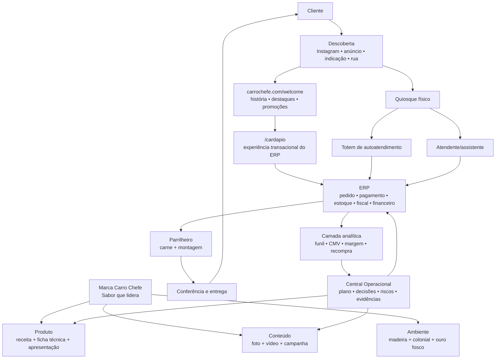
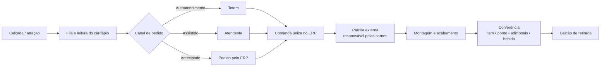
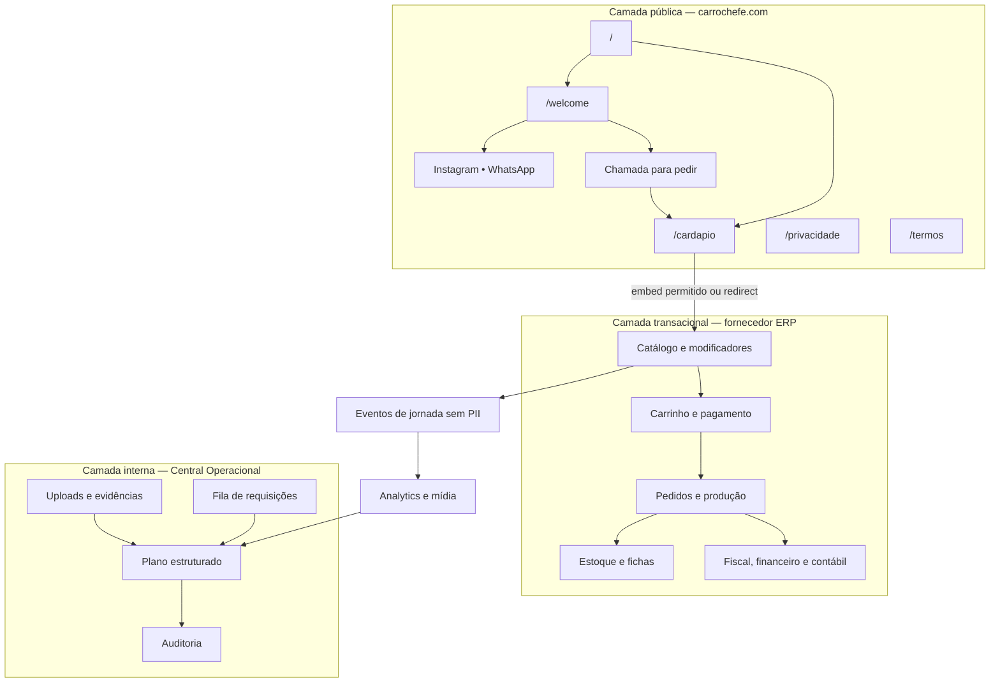
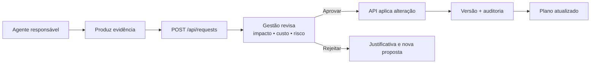

# Arquitetura do Carro Chefe

## Visão executiva

O Carro Chefe deve operar como três produtos conectados:

1. **Produto gastronômico:** espetos, Carro‑Chefe, Chefão, acompanhamentos e bebidas com padrão repetível.
2. **Experiência física:** quiosque colonial na calçada, parrilla visível, atendimento assistido e autoatendimento.
3. **Sistema de dados:** ERP como núcleo transacional, site como aquisição/apresentação e Central Operacional como coordenação.

Objetivo norteador: **vender um produto memorável com velocidade, margem e dados suficientes para repetir, melhorar e escalar a operação**.

## Mapa do negócio

## Arquitetura física e fluxo

Regras de layout:

- cliente não cruza fluxo de equipe, alimentos crus, lixo ou reposição;
- parrilla visível valoriza o produto, mas precisa de barreira, ergonomia, proteção climática e controle de calor/fumaça;
- atendente e assistente ficam dentro do quiosque com acesso rápido a embalagem, bebidas e ERP;
- totem fica antes do ponto de pagamento assistido, sem bloquear fila ou retirada;
- placa de menu precisa ser legível da fila; QR code é apoio, não substituto;
- retirada deve ter identificação de pedido e espaço para conferência;
- a solução final depende de medidas, energia, água, esgoto, ventilação, acessibilidade e exigências locais ainda não informadas.

## Arquitetura digital

### Contrato das rotas públicas

| Rota | Responsável | Finalidade | Regra |
|---|---|---|---|
| `/` | site público | entrada | redirecionar ou renderizar `/welcome` |
| `/welcome` | Development + Marca | apresentação imersiva | rápida, acessível, com redução de movimento |
| `/cardapio` | ERP + Development | pedido | iframe somente se permitido; fallback de redirect |
| `/privacidade` | Gestão + jurídico | transparência de dados | listar finalidades, fornecedores e contato |
| `/termos` | Gestão + jurídico | condições de uso | incluir pedido, pagamento, retirada e álcool |

### `/welcome` e interações 3D

A narrativa 3D deve apoiar o produto, não atrasá-lo:

1. jipe/brasão surge sobre madeira e metal;
2. deslocamento revela o espeto na brasa;
3. ingredientes compõem o Carro‑Chefe;
4. o Chefão apresenta escala e adicionais;
5. chamada final oferece “Pedir agora”, WhatsApp e Instagram.

Requisitos: carregamento progressivo, imagem substituta, respeito a `prefers-reduced-motion`, navegação por teclado, texto alternativo, métricas de desempenho e botão de pedido sempre alcançável.

## Sistemas de registro

| Domínio | Fonte oficial | Observação |
|---|---|---|
| Produto, preço e disponibilidade | ERP | site apenas consome/exibe |
| Pedido, pagamento e fiscal | ERP/adquirente | não replicar cartão ou checkout |
| Estoque, compras e custos | ERP | ficha técnica conecta venda a consumo |
| Plano, tarefas, decisões e riscos | Central Operacional | alterações via API aprovada |
| Ativos finais de marca | repositório + biblioteca de mídia | original imutável, derivados versionados |
| Campanhas | plataforma de mídia + registro interno | UTMs e custo conciliados com pedidos |
| Indicadores consolidados | camada analítica | reconciliação diária com ERP |

## Camadas de integração

1. **Identidade:** IDs estáveis de produto, modificador, ingrediente, canal e campanha.
2. **Eventos:** jornada do site, pedido e produção com timestamp e canal.
3. **Sincronização:** webhook quando disponível; consulta incremental como fallback.
4. **Conciliação:** total de pedidos/pagamentos por dia comparado ao ERP.
5. **Observabilidade:** logs sem dados sensíveis, alertas de falha e reprocessamento idempotente.
6. **Governança:** dicionário de dados, retenção, acesso por função e auditoria.

## Arquitetura de decisão

## Limites atuais

- preços, gramaturas, custos, endereço, horários e data de abertura ainda não foram fornecidos;
- ERP, adquirente, hospedagem e hardware ainda não foram escolhidos;
- não há planta com medidas do quiosque;
- licenças e regras municipais precisam de validação local;
- nenhuma métrica de venda é real até o início da operação.
