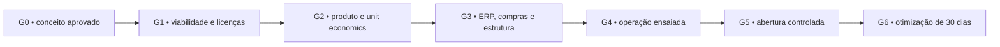

# Roadmap de execução

O roadmap é organizado por portões de decisão. Uma fase não deve avançar se o portão anterior deixar risco crítico sem responsável.

## Caminho crítico

## G0 — Fundação imediata

Objetivo: transformar a ideia em decisões controladas.

- confirmar nome legal/comercial, responsáveis e orçamento-limite;
- arquitetura de nomes aprovada: Carro Chefe como marca, Carro‑Chefe Simples como produto de entrada, **Brasa Dourada** como intermediário e “Paulistinha” apenas como alias legado interno;
- reconhecer que fotos, medidas, infraestrutura e validações presenciais do ponto **já existem**, porém são mantidas fora do repositório por decisão do proprietário; quando uma tarefa depender de detalhe físico, solicitar o dado diretamente ao proprietário ou registrar `INFO-PEND-*` em `docs/governanca/RISCOS_DECISOES.md`;
- congelar escopo do MVP do cardápio;
- definir data-alvo somente depois da análise de licenças e obras;
- criar contas e acessos com autenticação forte e proprietários definidos.

Saída: decisões críticas registradas, orçamento preliminar e responsável por cada frente.

## G1 — Viabilidade, conformidade e espaço

Objetivo: saber se, onde e sob quais condições a operação pode abrir.

- consultar contador e responsáveis locais sobre empresa, fiscal e contratação;
- mapear alvará, vigilância sanitária, bombeiros, ocupação de calçada, resíduos, gás/energia e venda de álcool;
- usar as medições e evidências presenciais existentes, solicitando ao proprietário somente os dados específicos necessários à tarefa;
- desenhar planta operacional com fluxo de crus, prontos, equipe, fila e retirada;
- dimensionar energia, água, frio, ventilação, iluminação, internet e segurança com base nos dados presenciais disponíveis e validações profissionais aplicáveis;
- prever estação segura para maçarico, montagem visível, molhos e pimentas de balcão;
- cotar adequações e criar reserva de contingência.

Saída: checklist de licenças, planta validada e custo de implantação por faixa.

## G2 — Produto, cardápio e economia unitária

Objetivo: tornar cada produto repetível, seguro e rentável.

- testar receitas, gramaturas, tempos, rendimento e apresentação;
- criar ficha técnica de ingrediente, embalagem e perda;
- calcular CMV, margem de contribuição e preço por cenário;
- simular e validar a estratégia **Escada do Chefe** sem publicar preço antes da aprovação financeira;
- mapear alérgenos e substituições;
- testar Carro‑Chefe Simples, **Brasa Dourada**, Chefão e Espeto Completo com clientes-piloto;
- homologar quantidade de caldo do vinagrete por pão e medir a economia líquida obtida com a retirada da maionese-base;
- validar tipo/gramatura e método seguro do queijo maçaricado do Brasa Dourada;
- validar tempo de estação e consistência da cebola-roxa tostada;
- criar fichas técnicas dos molhos caseiros aprovados, com rendimento, custo e rotina de conservação;
- testar a etapa de escolha de molhos à vontade sem criar gargalo;
- retirar alface das fichas e novas referências de todos os lanches;
- aprovar nomes, descrições e arquitetura de modificadores.

Saída: cardápio MVP com ficha técnica, custo, preço aprovado, foto, sequência de montagem e tempo padrão.

## G3 — ERP, equipamentos, fornecedores e canais

Objetivo: ligar venda, produção, estoque e financeiro antes de gerar demanda.

- selecionar ERP por prova de conceito com o fluxo real do Chefão;
- escolher totem, pin pad/adquirente, impressora/KDS e contingência de internet;
- cadastrar produtos, modificadores, insumos, receitas e fornecedores;
- cadastrar `MOD-MOLHO-LIVRE` separado de pimentas de balcão;
- sincronizar site, ERP e dados financeiros com a retirada de alface, nome Brasa Dourada e nova composição;
- validar baixa automática de estoque e conciliação de pagamento;
- contratar equipamentos e insumos pelo método de custo total/avaliações;
- homologar equipamento/procedimento de maçarico antes de uso real;
- construir versão leve de `/welcome` e integrar `/cardapio`;
- configurar analytics, UTMs, pixels e política de privacidade.

Saída: pedido de ponta a ponta aprovado em todos os canais e compras críticas entregues.

## G4 — Operação ensaiada

Objetivo: provar a rotina sem clientes reais.

- contratar/definir parrilheiro, atendente e assistente;
- treinar abertura, pré-preparo, atendimento, produção, montagem visível, escolha de molhos, conferência e fechamento;
- simular pico com pedidos mistos e falhas de internet/pagamento;
- medir capacidade, gargalo, tempo de fila e tempo de preparo;
- medir especificamente impacto de cebola tostada, maçarico e etapa de molhos no ciclo do Brasa Dourada;
- medir consumo médio e reposição de cada molho;
- calibrar estoque mínimo, ponto de reposição e desperdício;
- produzir banco inicial de fotos/vídeos e campanha de pré-abertura.

Saída: dois ensaios completos sem falha crítica e plano de contingência conhecido pela equipe.

## G5 — Abertura controlada

Objetivo: aprender com risco e volume limitados.

- realizar soft opening com janela e público controlados;
- acompanhar pedidos, aprovação de pagamento, tempo, ruptura, erro e feedback;
- observar mix, ticket e margem dos três degraus da Escada do Chefe antes de alterar preço/apresentação;
- acompanhar consumo real dos molhos e impacto econômico do caldo do vinagrete/queijo maçaricado;
- limitar mídia paga até estabilizar produção e disponibilidade;
- fazer reunião diária de 15 minutos e fechamento de caixa/estoque;
- corrigir descrição, embalagem, layout e treinamento com evidência.

Saída: três ciclos de operação estáveis antes de ampliar mídia ou horário.

## G6 — Primeiros 30 dias e escala

Objetivo: transformar aprendizagem em crescimento rentável.

- revisar cardápio por margem, popularidade e complexidade;
- recalibrar a Escada do Chefe com dados de mix, margem, adicionais, bebida e recompra;
- revisar custo/consumo dos molhos à vontade e perdas do vinagrete;
- ativar remarketing e campanhas por raio somente com rastreamento conciliado;
- criar rotina de recompra via WhatsApp com consentimento;
- negociar fornecedores com base em consumo real;
- decidir novos horários, delivery e expansão apenas após capacidade comprovada;
- fechar painel de DRE gerencial, desperdício, CAC, recompra e NPS/avaliação.

## Matriz de prioridade

| Quadrante | Conduta | Exemplos iniciais |
|---|---|---|
| Impacto 5 / Urgência 5 | fazer agora | viabilidade do ponto, licenças, fichas técnicas, ERP prova de conceito |
| Impacto 5 / Urgência 3–4 | agendar no caminho crítico | site, analytics, ensaio de pico, fornecedores alternativos |
| Impacto 3–4 / Urgência 5 | resolver com prazo curto | artes de impressão, cadastro de canal, treinamento específico |
| Impacto 1–2 | manter no backlog | expansões, novas linhas e automações não essenciais |

O painel calcula a base como `impacto × urgência`. A nota não substitui julgamento de segurança, dependência ou caixa.

## Cadência de gestão

- **Diária na implantação:** bloqueios, compras com prazo, decisões e caminho crítico.
- **Semanal:** entregas por agente, orçamento, risco, próximos sete dias e métricas de aquisição.
- **Diária na abertura:** vendas, tempo, ruptura, desperdício, incidentes e avaliação.
- **Mensal:** DRE gerencial, mix, margem, campanhas, fornecedores, pessoas e roadmap.

## Critério de mudança de fase

Cada portão exige: evidências anexadas, decisões fechadas, riscos críticos com mitigação, orçamento atualizado, dependências satisfeitas e aprovação da Gestão/proprietário.