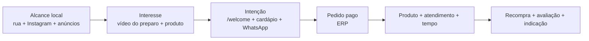

# Marketing, mídias e lançamento

## Posicionamento inicial

**Carro Chefe é o espeto que vira lanche de assinatura, preparado diante do cliente em um quiosque colonial de esquina.**

Pilares de mensagem:

- **produto protagonista:** brasa, textura, montagem e escolha do espeto;
- **ritual visível:** parrilla e preparo como prova de sabor;
- **personalização simples:** escolha que não trava a fila;
- **identidade memorável:** jipe-chef, madeira, bronze e “Sabor que lidera”;
- **conveniência local:** pedido no totem, atendimento ou site.

As alegações devem ser verdadeiras e demonstráveis. Evitar “o melhor”, “artesanal”, “premium” ou promessas de tempo sem critério definido.

## Público e raio

Hipóteses a validar por observação e vendas:

- moradores e trabalhadores próximos buscando jantar/lanche;
- pessoas que já consomem espetinho/churrasco, mas querem formato prático;
- grupos atraídos pelo Chefão e por conteúdo visual;
- clientes de passagem impactados pela fachada, cheiro e parrilla visível.

Tráfego pago deve começar com raio pequeno, horários em que a operação tem capacidade e exclusão de zonas sem atendimento. O ERP precisa distinguir pedido pago de mero clique.

## Estratégia comercial aprovada — Escada do Chefe

A arquitetura de cardápio aprovada em 17/09/2026 usa três produtos com funções diferentes:

- **Carro‑Chefe Simples:** porta de entrada econômica e de baixo risco percebido;
- **Carro‑Chefe Brasa Dourada:** produto intermediário de sabor, com identidade própria de cheddar, cebola-roxa tostada na parrilla, barbecue e batata palha;
- **Chefão:** experiência completa, com 30 cm, dois espetos e maior presença visual.

O objetivo não é empurrar todos para o item mais caro. A estratégia deve permitir que dois perfis cheguem a conclusões favoráveis à marca:

- quem busca preço percebe o Simples como acesso fácil ao produto principal;
- quem busca experiência percebe o Chefão como um salto de valor desproporcionalmente maior que o salto de preço.

O Brasa Dourada serve como ponte real entre os dois, não como opção propositalmente ruim.

### Regras de comunicação

- mostrar os três lanches próximos para facilitar comparação;
- manter o preço do Simples muito fácil de encontrar;
- descrever o Simples como **“O essencial do Carro‑Chefe”**, ou mensagem equivalente, sem depreciá-lo;
- apresentar o Brasa Dourada como receita de assinatura de brasa, e não como “Simples + cheddar”;
- no Chefão, comunicar primeiro fatos de valor — **30 cm • 2 espetos • composição completa • até 2 adicionais inclusos**, quando essa regra estiver definitivamente validada — e depois o preço;
- dar ao Chefão a maior fotografia/área visual entre os três;
- usar no Chefão rótulos factuais como **“Experiência completa”**, sem alegar “mais vendido” antes de haver dados;
- não usar preço riscado, promoção fictícia, escassez artificial ou porcentagem de economia não demonstrável;
- manter o CTA **Monte seu lanche** como rota própria, sem interromper a comparação rápida das receitas prontas.

### Direção visual

- **Simples:** layout limpo, informação objetiva, fotografia honesta e preço em alto contraste;
- **Brasa Dourada:** bronze/brasa, close de cheddar, cebola tostada e crocância; riqueza visual sem competir em escala com o Chefão;
- **Chefão:** maior presença, enquadramento de comprimento e recheio, detalhes dourados e os números `30 cm` e `2 espetos` facilmente legíveis.

O preço final continua dependente de ficha técnica e margem. A referência relativa da Escada do Chefe está em [`PRODUTO_CARDAPIO.md`](./PRODUTO_CARDAPIO.md).

### Aumento de ticket por degrau

Depois que o cliente escolhe o produto principal, o upsell deve respeitar a escolha:

- Simples → bebida e um adicional compatível;
- Brasa Dourada → bebida e comparação transparente com Chefão quando houver diferença real calculada;
- Chefão → bebida e acompanhamento/combinação somente após margem validada.

Evitar insistência que aumente abandono. O objetivo é elevar **margem e ticket por pedido pago**, não cliques em upgrades.

### Testes e mensuração

Acompanhar por produto e canal:

- visualização → seleção → pagamento;
- mix Simples/Brasa Dourada/Chefão;
- ticket e margem por degrau;
- taxa de bebida/adicional;
- troca de produto antes do checkout;
- abandono depois de preço;
- recompra por primeiro produto comprado.

Testes de foto, texto, posição, badge e preço devem isolar variáveis sempre que possível. Não alterar preço, composição e fotografia simultaneamente e depois atribuir o resultado a uma única causa.

## Funil

Métrica principal por estágio:

- alcance qualificado/visualização completa;
- clique para cardápio e visualização de produto;
- conversão em pagamento aprovado;
- margem por pedido e tempo de preparo;
- recompra e avaliação.

## Plano de lançamento

### Pré-abertura

- apresentar a marca e o “carro que virou chef”;
- bastidores do quiosque, madeira, metal, parrilla e testes;
- revelar cada produto somente após ficha/foto aprovadas;
- captar interessados pelo Instagram/WhatsApp com consentimento;
- anunciar data apenas quando G3 e G4 estiverem aprovados.

### Soft opening

- convite controlado por janela/quantidade;
- conteúdo registra o preparo real e feedback autorizado;
- mídia paga limitada ao volume que a operação consegue entregar;
- oferta não pode mascarar CMV ou criar fila insegura;
- observar separadamente aceitação do Simples, Brasa Dourada e Chefão antes de recalibrar a Escada do Chefe.

### Primeiros 30 dias

- campanha principal do Carro‑Chefe, com Chefão como peça de escala/compartilhamento e Brasa Dourada como receita intermediária de assinatura;
- remarketing para quem abriu cardápio sem comprar, quando juridicamente e tecnicamente permitido;
- campanha de recompra baseada em intervalo real, consentimento e margem;
- testes A/B de criativo/oferta, sem alterar várias variáveis ao mesmo tempo;
- pausa automática/manual quando ERP indicar ruptura ou saturação.

## Calendário editorial inicial

| Pilar | Formatos | Frequência indicativa | Objetivo |
|---|---|---|---|
| Produto | macro, corte, montagem, ASMR | 2–3/semana | desejo e compreensão |
| Bastidores | parrilla, preparação, quiosque | 2/semana | confiança e identidade |
| Escolha | espeto/adicionais/combinações | 1–2/semana | reduzir dúvida |
| Prova social | reação, avaliação, UGC autorizado | 1/semana | credibilidade |
| Serviço | horário, localização, pedido | stories recorrentes | conversão |

Frequências são ponto de partida e devem ceder à qualidade e capacidade de produção.

## Biblioteca de mídia

Metadados obrigatórios: data, autor, produto, canal, formato, versão, status de aprovação, direitos/consentimento, campanha e data de expiração quando houver.

Nomenclatura: `AAAA-MM-DD_pilar-assunto_formato_vNN_status.ext`.

Status: `draft`, `review`, `approved`, `published`, `retired`.

## Etiqueta e QR code

Conteúdo mínimo proposto:

- logo legível;
- `carrochefe.com` e QR code com destino controlado;
- Instagram `@carrochefe_cg`;
- WhatsApp `(67) 9 9204-6721`;
- área segura e contraste suficientes para leitura.

Antes de imprimir em lote: testar QR em Android/iPhone, luz baixa, embalagem curva e distâncias reais; definir UTM/redirecionamento para trocar destino sem reimpressão; revisar informações obrigatórias da embalagem com profissional.

## Governança de campanha

Cada campanha registra: hipótese, público, canal, criativos, período, orçamento máximo, oferta, capacidade disponível, UTMs, evento de conversão, margem esperada, regra de pausa e responsável.

Nenhum resultado é declarado incremental sem método. Começar comparando períodos/células equivalentes e evoluir para testes geográficos ou de holdout quando o volume permitir.
