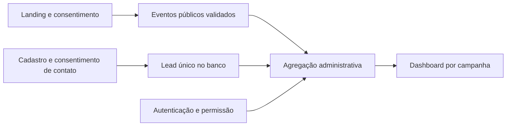

# Dashboard de campanhas — proposta para implementação

Data: 14/09/2026. Estado: próximo passo especificado, ainda não implementado. Owner de implementação: AG-DEV; contratos/métricas: Dados; oferta/funil: Marketing; aprovação de consolidação: Gestão.

## Objetivo e primeira tela

Permitir que administradores comparem origem, interesse e inscrições por campanha sem acessar telefones para cada análise. A visão inicial terá período, campanha, QR e variante; incluirá “Direto / sem identificação” e “Campanha não cadastrada”. O fuso do relatório deve ser explicitamente definido como `America/Campo_Grande`, com armazenamento de instantes em UTC.

Cards: visualizações observadas, sessões observadas, inscrições novas no banco, conversão observada, cliques em WhatsApp, cliques em Instagram e retornos identificáveis. Gráfico diário; tabela comparativa por campanha; funil por etapa; detalhes de uma campanha. Não exibir faturamento, CAC ou ROAS como resultados antes de integrar gasto e pedidos pagos do ERP.

## O que existe e como contar

| Métrica solicitada | Fonte / definição | Limitação atual |
|---|---|---|
| Quantos acessaram | `landing_view`: visualizações; `COUNT(DISTINCT sessionId)`: sessões observadas | Analytics opcional; não é total de pessoas nem total de tráfego |
| Quantos se inscreveram | `PrelaunchLead`, período de `signupAt`, telefone normalizado único | Inclui quem recusou analytics; nunca substituir pelo total de eventos `signup_success` |
| Quantos vieram de cada campanha | Eventos agrupados por `ccCampaign`, `ccQr`, `ccVariant`; inscrições agrupadas separadamente | Origem analítica é da interação; origem do lead é da primeira inscrição bem-sucedida |
| Cliques em WhatsApp | Total de `whatsapp_click` e sessões distintas com esse evento | Clique não comprova conversa, mensagem ou pedido |
| Cliques em Instagram | Total de `instagram_click` e sessões distintas | Clique não comprova follow ou visualização do perfil |
| Mais de um acesso | Sessões com mais de um `landing_view` | Indica múltiplas cargas na mesma sessão/aba; não comprova uma pessoa retornando em outro dia |
| Abandono do formulário | Sessões com `form_start` sem `signup_success`/`signup_duplicate` no recorte definido | Pode incluir janela incompleta, recusa de medição e falha de rede |
| Duplicidade e erros | `signup_duplicate`, `signup_error` | Eventos são melhor esforço; quedas de rede podem impedir sua chegada |
| Entrada com QR | `qr_scan` | Link compartilhado ou digitado também gera evento; não equivale a scan físico comprovado |

**Conversão observada:** sessões consentidas com pelo menos um `signup_success` dividido por sessões consentidas com `landing_view`, na mesma campanha e coorte de entrada. Não dividir todos os leads (incluem recusas) somente pelas visitas consentidas. Em denominador zero, mostrar “Sem base suficiente”, não 0% ou infinito. Mostrar separadamente inscrições totais no banco e inscrições observadas no funil.

Uma sessão pode visitar duas campanhas; a soma das sessões distintas por campanha pode superar as sessões globais distintas. Duplicatas não aumentam inscrições novas. Cadastros cancelados devem ter status e contagem separados; não apagar o histórico para ajustar métricas. Período e janela de conversão devem ser visíveis.

## Evolução necessária para retorno e atribuição completos

1. Definir `pageViewId` e `eventId` estáveis por interação, com unicidade no servidor: permitir retry controlado sem contar duplicatas. Hoje o `requestId` é gerado no servidor e não deduplica uma retransmissão do cliente.
2. Definir `visitorId` aleatório de primeira parte, somente para analytics permitido, com prazo de retenção, revogação e expiração explícitos. Não usar fingerprint, telefone, nome, IP ou hash de telefone para reconhecer pessoas. Rotular “navegadores recorrentes”, não “pessoas identificadas”; múltiplos aparelhos e limpeza do navegador continuam limitando a contagem.
3. Definir sessão por inatividade e nova entrada, e medir retorno em dias distintos. Hoje `sessionId` dura a sessão da aba; abas duplicadas/restauradas podem afetar unicidade. A primeira visita desconhecida antes do aceite pode ser registrada somente enquanto estiver na fila em memória; recusa não deve ser recuperada retroativamente.
4. Criar catálogo de campanhas com ID estável, nome, peça, origem, variante, estado e regra do benefício. URLs desconhecidas continuam atribuídas, mas não ativam uma oferta por suposição. Benefício sensível exige validação no servidor; parâmetros da URL são identificação pública, não prova de elegibilidade.
5. Separar lead de participação em campanha: uma pessoa já inscrita pode participar de outra ação sem sobrescrever a primeira origem nem virar um segundo lead. Definir regra aprovada de elegibilidade, vínculo, consentimento e entrega; nenhuma alteração silenciosa da inscrição atual.
6. Adicionar confirmação operacional de envio/entrega/cancelamento via integração autorizada de WhatsApp, com trilha auditável. Cadastro salvo não significa telefone verificado ou mensagem entregue. Integração com ERP permitirá futuramente ligar campanha a pedido pago/margem, por contrato minimizado.

## Implementação em duas entregas

**Primeira entrega — leitura administrativa do que já existe.** Criar página `/gestao/campanhas` e API de agregação autenticada, com autorização server-side por permissão. O frontend recebe números agregados, não tabelas completas nem telefones. Filtros validados, intervalo e página máximos, paginação da tabela; seleção apenas de colunas necessárias. Conferir índices atuais de campanha/variante/data e planos das consultas antes de novos índices. Nunca juntar leads e eventos diretamente de forma que multiplique inscrições por cada clique.

Estados obrigatórios: carregando, sem dados, sem permissão, erro com tentar novamente, resultados parciais e aviso de cobertura consentida. No celular, cartões e linhas expansíveis substituem tabela larga. Exportação agregada com filtros/data/fuso; eventual exportação de contatos exige permissão separada e auditoria. Zero endpoints públicos para listar leads.

**Segunda entrega — dados de retorno e participação.** Aprovar contratos acima; adicionar migrações compatíveis e testes de idempotência, expiração, revogação, mistura de campanhas e retorno entre sessões. Configurar exclusão do ambiente QA e filtragem explícita de tráfego automatizado. Publicar histórico de mudança de definição das métricas: dados antigos não ganham `visitorId` retroativamente.

## Critérios de aceite

- Totais batem com fixtures conhecidas de acesso direto, campanha A/B, QR desconhecido, duplicidade, múltiplos cliques, várias cargas, falha e recusa de analytics.
- Inscrições novas usam o banco como fonte e ficam separadas do funil observado; nenhuma taxa mistura universos de coleta.
- Período, fuso e atribuição aparecem na tela e exportação. Retornos entre sessões mostram “Não disponível” até a instrumentação existir.
- Acesso sem autenticação ou sem permissão não revela agregados administrativos nem contatos; resposta e logs não expõem dados pessoais.
- Consultas são paginadas/limitadas, têm desempenho medido com volume representativo e são verificadas contra multiplicação por joins.
- QA não entra nos resultados comerciais; cliques não são apresentados como mensagens/follows; scans não são tratados como pessoas únicas.
- Desktop/mobile, teclado, contraste, estados vazios/erro e integração completa passam pelos testes do projeto antes de integrar à main.

Decisões pendentes: benefício concreto e elegibilidade de já inscritos (Marketing/Gestão), definição de sessão/retorno e retenção (Dados/Gestão), permissão administrativa e hospedagem/autenticação (Development/Gestão). Esta especificação não autoriza divulgação, envio de mensagens, alteração de DNS ou operação no ERP.
