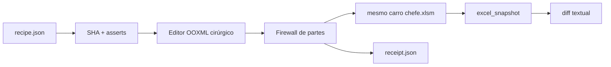

# Excel Recipe V1 — edição transacional do XLSM

## Status

A V1 está implementada para editar o mesmo arquivo `anexos/financeiro/carro chefe.xlsm` por receitas JSON versionadas, sem depender do Excel Desktop e sem criar cópias permanentes da planilha.

Ela foi validada em Ubuntu e Windows com testes sintéticos, receita `noop` contra o workbook real e um probe `dry-run` que reserializa uma worksheet real, o Table Part `CaProdutos` e `workbook.xml` em candidato temporário. O candidato é descartado; a planilha versionada não é modificada pelo probe.

## Objetivo

Permitir que agentes proponham alterações na planilha operacional por meio de um roteiro JSON, produzam a mudança em uma branch e entreguem ao proprietário **o mesmo arquivo** `anexos/financeiro/carro chefe.xlsm` atualizado — sem controlar o computador local, sem criar versões paralelas e sem sobrescrever trabalho local durante a sincronização.

## Arquitetura



O motor usa somente a biblioteca padrão do Python para modificar ZIP/XML. Ele **não usa `openpyxl` para salvar o workbook**. Isso é intencional: o arquivo atual contém VBA, ActiveX, gráficos e pivôs, então a V1 só reserializa as partes XML que cada operação declara como alteráveis.

## Garantias operacionais

Toda receita aponta para uma versão exata do workbook por `expected_sha256` e, na V1, deve também fixar `expected_vba_sha256`. Se a base mudou desde a criação da receita, a execução falha antes de editar.

O motor calcula SHA-256 de cada parte do pacote antes e depois. Alterações fora da allowlist da operação abortam a execução. `xl/vbaProject.bin`, `xl/activeX/*`, `xl/charts/*`, `xl/pivotTables/*`, `xl/pivotCache/*` e `xl/media/*` são imutáveis na V1.

As operações são feitas primeiro em candidato temporário. O pacote é reaberto e validado, o hash do VBA é conferido novamente e somente então o arquivo original pode ser substituído. Se a regeneração do snapshot falhar, o workbook anterior é restaurado.

## Tabelas

A V1 manipula Table Parts e células de worksheet de forma coordenada. Ao inserir registro, procura espaço lógico vazio, preserva estilos, reaplica `calculatedColumnFormula` quando aplicável e só expande o `ref` da tabela quando necessário.

`table.delete_rows` é exclusão **lógica**: limpa os registros encontrados sem deslocar fisicamente as linhas. Esse comportamento é deliberado para evitar quebrar referências externas, validações, gráficos, pivôs ou VBA.

## Fórmulas e recálculo

Alterações de fórmula removem o valor em cache da célula e marcam o workbook para recálculo completo na próxima abertura. O motor não tenta reproduzir o cálculo do Excel.

A tradução A1 de `formula.copy` é opt-in. Refactors globais de referências estruturadas, nomes definidos, fórmulas, VBA, gráficos e pivôs não pertencem à V1.

## Quando não usar a V1

Não use a V1 para renomear tabela ou coluna usada por dependências externas, inserir/excluir linha ou coluna física no meio de uma worksheet, editar VBA/ActiveX, alterar pivôs/gráficos, fazer refresh de Power Query ou depender de cálculo headless do Excel. Essas ações devem falhar ou ser tratadas por uma versão posterior com mapa de dependências.

Também não aplique receita sobre workbook com SHA diferente do analisado, não edite receipts manualmente e não use `--no-snapshot` em manutenção normal.

## Fluxo Git obrigatório

A manutenção começa na `main` atual, segue em branch própria, versiona a receita, executa validação/aplicação, revisa snapshot + receipt e só integra depois dos checks. Após o merge, o proprietário sincroniza com:

```bash
python -m tools.excel_recipe.sync
```

O `sync` exige `main`, recusa workbook modificado localmente e usa apenas `git fetch` + `git merge --ff-only`. Ele não executa `reset --hard`, `stash`, `checkout --force` nem cria cópias do `.xlsm`.

## Critérios de pronto da V1

A V1 é considerada pronta quando CRUD de valores/fórmulas e registros de tabela, criação/remoção/redimensionamento seguro de Table Parts, asserts, hashes, firewall, receipt, snapshot, CI Linux/Windows e sincronização fast-forward estiverem verdes.

O manual operacional está em `tools/excel_recipe/README.md`. O procedimento para agentes está em `docs/governanca/EXCEL_RECIPE_AGENT_GUIDE.md`. A próxima entrega está definida em `docs/tecnologia/EXCEL_RECIPE_V2_PLAN.md`.
